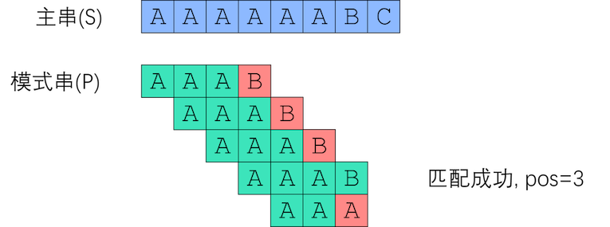
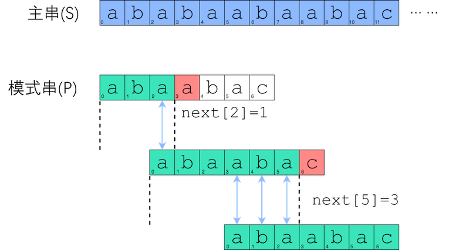
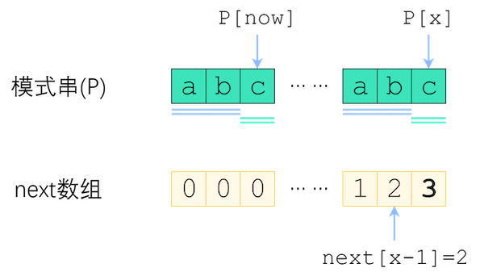
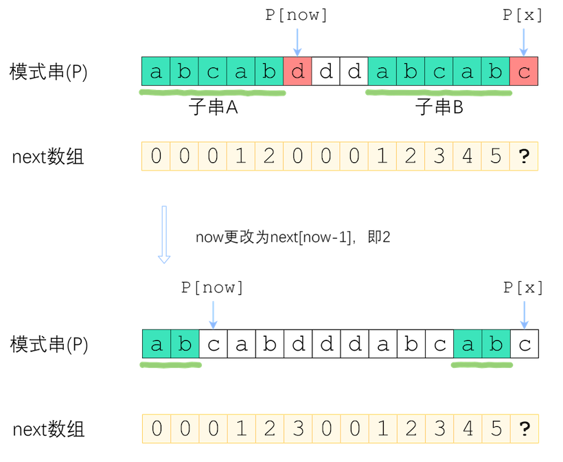

# KMP算法：字符串查找


常见的字符串查找算法有，Knuth-Morris-Pratt算法、Boyer-Moore算法、Sunday算法等，这里讲解Knuth-Morris-Pratt算法。

Knuth-Morris-Pratt字符串查找算法（简称为KMP算法）可在一个主串S内查找一个模式串P的出现位置。一个词在不匹配时本身就包含足够的信息来确定下一个匹配可能的开始位置，此算法利用这一特性以避免重新检查先前配对的字符。这个算法由James H. Morris、Donald Knuth、Vaughan Pratt三人于1977年联合发表。

此算法是历史上第一个线性时间字符串查找算法。

**暴力求解**

如果通过暴力求解，搜索P在S中出现的位置，则可以顺序从左到右遍历S，并依次与P进行对比。



显然时间复杂度为$O(nm)$。

在正式介绍KMP算法之前，首先引出字符串的前缀、后缀以及最长公共前后缀的概念：

**前缀、后缀、最长公共前后缀与next数组**

前缀：以字符串第一个字符作为开头，同时不包括最后一个字符的所有子串。

后缀：以字符串最后一个字符作为结尾，同时不包括第一个字符的所有字串。

```
举例：字符串"ABADABA"的前缀与后缀
前缀为["A", "AB", "ABA", "ABAD", "ABADA", "ABADAB"]
后缀为["BADABA", "ADABA", "DABA", "ABA", "BA", "A"]

注意，这里的前缀与后缀都不包含空串和自身。
```

公共前后缀：字符串前缀列表与后缀列表中，公共包含的子串。

最长公共前后缀：公共前后缀中长度最长的子串。

```
举例：字符串"ABADABA"的公共前后缀为"ABA"、"A"，其中最长公共前后缀为"ABA"。
```

next数组：字符串所有的前缀的最长公共前后缀的长度构成的数组，一般称为字符串的next数组。

```
举例：求P="abaabac"的next数组
前缀"a"：前缀为空，后缀为空，公共前后缀为空，最长公共前后缀长度为0；
前缀"ab"：前缀为["a"]，后缀为["b"]，公共前后缀为空，最长公共前后缀长度为0；
前缀"aba"：前缀为["a", "ab"]，后缀为["ba", "a"]，公共前后缀为["a"]，最长公共前后缀"a"，长度为1；
前缀"abaa"：前缀为["a", "ab", "aba"]，后缀为["baa", "aa", "a"]，公共前后缀为["a"]，最长公共前后缀"a"，长度为1；
前缀"abaab"：前缀为["a", "ab", "aba", "abaa"]，后缀为["baab", "aab", "ab", "b"]，公共前后缀为["ab"]，最长公共前后缀"ab"，长度为2；
前缀"abaaba"：前缀为["a", "ab", "aba", "abaa", "abaab"]，后缀为["baaba", "aaba", "aba", "ba", "a"]，公共前后缀为["a", "aba"]，最长公共前后缀"aba"，长度为3；
前缀"abaabac"：前缀为["a", "ab", "aba", "abaa", "abaab", "abaaba"]，后缀为["baabac", "aabac", "abac", "bac", "ac", "c"]，公共前后缀为空，最长公共前后缀长度为0；

所以，P="abaabac"的next数组为[0, 0, 1, 1, 2, 3, 0]
```

**KMP算法**

KMP即利用next数组来跳过一定不会匹配成功的地方，从而达到快速搜索的效果。



例如，在上述匹配搜索过程中：

首先求出P="abaabac"的next数组，上面例子已经求得为[0, 0, 1, 1, 2, 3, 0]。

当搜索到S[3]与P[3]时，发现不相等，此时查找next数组，P[3]前一个位置，即P[2]对应的next[2]=1，于是可以将模式串P在S[3]处向后滑动1个位置，即将P[1]与S[3]作为起始，向后继续进行匹配；

当搜索到S[8]与P[6]时，发现不相等，此时查找next数组，P[6]前一个位置，即P[5]对应的next[5]=3，于是可以将模式串P在S[8]处向后滑动3个位置，即将P[3]与S[8]作为起始，向后继续进行匹配；

最终找到匹配成功的位置。

```
那么为什么P[i]对比失败后，可以P向后滑动next[i-1]个位置，然后继续从P[next[i-1]]处开始匹配S呢？

其一，P向后滑动next[i-1]个位置，是因为子串P[0]~P[i-1]（简记为P[0:i]）的最大公共前后缀的长度就是next[i-1]。
因为已经有子串P[0:i]与S对应的部分相同，所以下一次P的公共前缀，就可以滑到上一次P的公共后缀位置上，这一段无需对比，一定相同，所以可以从P[next[i-1]]处继续匹配。

其二，向后滑动next[i-1]个位置，同时意味着将跳过上一个P[0]到下一个P[0]之间的位置的对比。
比如上述例子中，S[3]对比失败后，P从S[3]处向后滑动1个位置，意味着跳过1个位置S[1]；
同样的S[8]对比失败后，P从S[8]处向后滑动3个位置，意味着跳过2个位置S[3]、S[4]。
为什么可以跳过这些位置呢？假设不跳过这些位置（也就是P向后多滑动一些），那下一次P与上一次P的重叠部分一定大于next[i-1]，但next数组已经记录了子串P[0:i]的最大公共前后缀长度了，也就是下一次P前缀和上一次P后缀重叠后相同的最大长度。所以大于这个长度重叠后一定不相同，因此就没必要对比了。
```

**优化求解next数组**

求解next数组，同样可以使用暴力求解，容易计算出，其时间复杂度为$O(m^{2})$。

下面介绍一个快速计算next数组的方法，同样是利用next数组之前的计算结果，来得出当前next的值。

假设，我们已经求出next[x-1]的值，当求子串P[0]~P[x]的next值时，根据当前P[x]值的不同情况可以进行分类处理。

情况1：P[x]与前一个子串的最长公共前缀的下一个字符P[now]相同

如，前一个子串P[0]~P[x-1]的最长公共前（后）缀为"ab"，则now=next[x-1]=2

又有P[x]与P[now]相同，都为"c"，所以next[x]=next[x-1]+1=3



情况2：P[x]与前一个子串的最长前缀的下一个字符P[now]不同

如果P[x]与P[now]不同，则需要缩小对比范围，子串A向左缩小，子串B向右缩小。

子串A：P[0]~P[x-1]的最长公共前（后）缀

子串B：P[0]~P[x-1]的最长公共（前）后缀

要缩小多少呢？回过头来看一下now的定义，即前一个子串的最长前缀的下一个字符的位置，递归的，应当求解子串A的最长前缀的下一个字符的位置，即新的now=next[now-1]。



继续对比P[now]与P[x]，如果相等则next[x]=now+1，如果不相等，则可以继续now=next[now-1]，直到P[now]与P[x]相等或now=0且不相等（此时返回0）。

可以看出情况2和情况1本质上是相同的处理。

为什么要从now开始判断呢？可以更长吗？答案和上面分析KMP算法时的思考过程是类似的，不能更长，因为使用更长的前缀和后缀作为起始的话，它们俩就已经一定不相同，根本轮不到对比P[now]和P[x]，所以前缀的起始位置再长也不会超过now的长度。

**代码**

```java
public class KMP {

    public static void main(String[] args) {
        String sStr = "ababaabaabac";
        String pStr = "abaabac";
        kmp(sStr, pStr);
    }

    private static void kmp(String sStr, String pStr) {
        char[] s = sStr.toCharArray();
        char[] p = pStr.toCharArray();
        int[] next = buildNext(p);
        int tar = 0, pos = 0;
        while (tar < s.length) {
            if (s[tar] == p[pos]) {
                tar++;
                pos++;
            } else if (pos != 0) {
                pos = next[pos - 1];
            } else {
                tar++;
            }

            if (pos == p.length) {
                // 输出完整匹配p的所有s的起始位置
                System.out.println(tar - pos);
                pos = next[pos - 1];
            }
        }
    }

    private static int[] buildNext(char[] p) {
        int[] next = new int[p.length + 1];
        int x = 1, now = 0;
        while (x < p.length) {
            if (p[x] == p[now]) {
                now++;
                next[x] = now;
                x++;
            } else if (now != 0) {
                now = next[now - 1];
            } else {
                x++;
                next[x] = now;
            }
        }
        return next;
    }
}
```

- 时间复杂度：$O(n+m)$
- 空间复杂度：$O(m)$

参考：
1. [KMP算法教程](https://www.ruanx.net/kmp/)
2. [KMP算法](https://zh.wikipedia.org/wiki/KMP%E7%AE%97%E6%B3%95)
