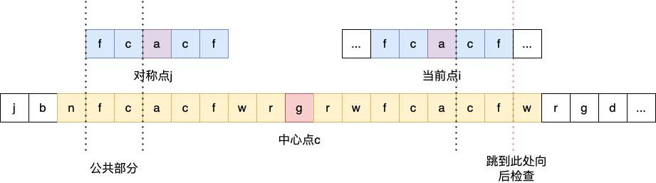

# Manacher算法：最长回文子串


在一个字符串中查找一个最长的连续的回文的子串，例如“banana”最长回文子串是“anana”。

**方法一：动态规划**

状态转移方程：
$$P(i,j)=P(i+1,j-1)\wedge(S_{i}==S_{j})$$
也就是说，只有$s[i+1:j-1]$是回文串，并且$s$的第$i$和$j$个字母相同时，$s[i:j]$才会是回文串。

说明：
- $s$：字符串
- $S_{i}$：$s$的第$i$个字符
- $s[i:j]$：下标从$i$到$j$的子串（包含$i$和$j$）
- $P(i,j)$：子串$s[i:j]$是否为回文串，$True$或$False$

```java
public class Solution {

    public String longestPalindrome(String s) {
        int len = s.length();
        if (len < 2) {
            return s;
        }

        int maxLen = 1;
        int begin = 0;
        // dp[i][j] 表示 s[i..j] 是否是回文串
        boolean[][] dp = new boolean[len][len];
        // 初始化：所有长度为 1 的子串都是回文串
        for (int i = 0; i < len; i++) {
            dp[i][i] = true;
        }

        char[] charArray = s.toCharArray();
        // 递推开始
        // 先枚举子串长度
        for (int L = 2; L <= len; L++) {
            // 枚举左边界，左边界的上限设置可以宽松一些
            for (int i = 0; i < len; i++) {
                // 由 L 和 i 可以确定右边界，即 j - i + 1 = L 得
                int j = L + i - 1;
                // 如果右边界越界，就可以退出当前循环
                if (j >= len) {
                    break;
                }

                if (charArray[i] != charArray[j]) {
                    dp[i][j] = false;
                } else {
                    if (j - i < 3) {
                        dp[i][j] = true;
                    } else {
                        dp[i][j] = dp[i + 1][j - 1];
                    }
                }

                // 只要 dp[i][L] == true 成立，就表示子串 s[i..L] 是回文，此时记录回文长度和起始位置
                if (dp[i][j] && j - i + 1 > maxLen) {
                    maxLen = j - i + 1;
                    begin = i;
                }
            }
        }
        return s.substring(begin, begin + maxLen);
    }
}
```

- 时间复杂度：$O(n^{2})$
- 空间复杂度：$O(1)$

**方法二：Manacher 算法**

Manacher算法的主要思想是避免不必要的回文子串重新比较。通过利用对称性，它可以跳过冗余的比较。

**处理奇数回文**

在计算当前点$i$的回文串时，可以利用臂长超越$i$点的中心点$c$的回文串（臂长和中心点c需要实时更新），找到$i$点关于$c$点的镜像对称点$j$，则以$j$为中心的回文串镜像之后同样也为$i$点的回文串（当然要注意$j$与$c$的回文串的边界，需取公共部分），这样就可以直接跳过一定回文的部分，直接向后进行检查。

**处理偶数回文**

上述处理需要回文串为奇数个字符，我们可以在所有字符之间插入一个相同字符，如"#"（不用与所有字符都不重复），使所有的偶数回文串转换为奇数回文串。

- 时间复杂度：$O(n)$
- 空间复杂度：$O(n)$

**代码**

```java
class Solution {
    public String longestPalindrome(String s) {
        int start = 0, end = -1;
        StringBuffer t = new StringBuffer("#");
        for (int i = 0; i < s.length(); ++i) {
            t.append(s.charAt(i));
            t.append('#');
        }
        t.append('#');
        s = t.toString();

        List<Integer> arm_len = new ArrayList<Integer>();
        int right = -1, j = -1;
        for (int i = 0; i < s.length(); ++i) {
            int cur_arm_len;
            if (right >= i) {
                int i_sym = j * 2 - i;
                int min_arm_len = Math.min(arm_len.get(i_sym), right - i);
                cur_arm_len = expand(s, i - min_arm_len, i + min_arm_len);
            } else {
                cur_arm_len = expand(s, i, i);
            }
            arm_len.add(cur_arm_len);
            if (i + cur_arm_len > right) {
                j = i;
                right = i + cur_arm_len;
            }
            if (cur_arm_len * 2 + 1 > end - start) {
                start = i - cur_arm_len;
                end = i + cur_arm_len;
            }
        }

        StringBuffer ans = new StringBuffer();
        for (int i = start; i <= end; ++i) {
            if (s.charAt(i) != '#') {
                ans.append(s.charAt(i));
            }
        }
        return ans.toString();
    }

    public int expand(String s, int left, int right) {
        while (left >= 0 && right < s.length() && s.charAt(left) == s.charAt(right)) {
            --left;
            ++right;
        }
        return (right - left - 2) / 2;
    }
}
```


参考：
1. [leetcode题解]( https://leetcode.cn/problems/longest-palindromic-substring/solution/)
2. [oi wiki: Manacher]([https://oi-wiki.org/string/manacher/](https://oi-wiki.org/string/manacher/))
