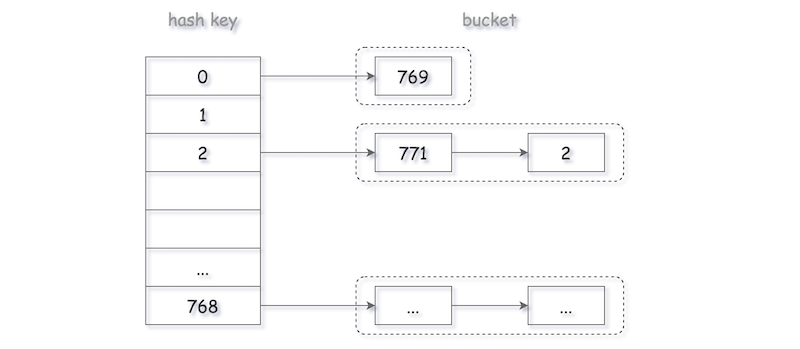

# HashSet与HashMap设计


首先设计一个考虑HashSet，主要考虑如下问题：

**哈希函数**：能够将集合中任意可能的元素映射到一个固定范围的整数值，并将该元素存储到整数值对应的地址上。

**冲突处理**：由于不同元素可能映射到相同的整数值，因此需要在整数值出现「冲突」时，需要进行冲突处理。总的来说，有以下几种策略解决冲突：

- 链地址法：为每个哈希值维护一个链表，并将具有相同哈希值的元素都放入这一链表当中。



- 开放地址法：当发现哈希值 $h$ 处产生冲突时，根据某种策略，从 $h$ 出发找到下一个不冲突的位置。例如，一种最简单的策略是，不断地检查 $h+1,h+2,h+3,…$ 这些整数对应的位置。
- 再哈希法：当发现哈希冲突后，使用另一个哈希函数产生一个新的地址。

这里以取整函数作为哈希函数，并使用链地址法来实现一个简易的HashSet：

```java
class MyHashSet {
    private static final int BASE = 769;
    private LinkedList<Integer>[] data;

    /**
     * 初始化
     */
    public MyHashSet() {
        data = new LinkedList[BASE];
        for (int i = 0; i < BASE; ++i) {
            data[i] = new LinkedList<>();
        }
    }

    public void add(int key) {
        int h = hash(key);
        for (Integer element : data[h]) {
            if (element == key) {
                return;
            }
        }
        data[h].offerLast(key);
    }

    public void remove(int key) {
        int h = hash(key);
        for (Integer element : data[h]) {
            if (element == key) {
                data[h].remove(element);
                return;
            }
        }
    }

    /**
     * 如果存在key，则返回true
     */
    public boolean contains(int key) {
        int h = hash(key);
        for (Integer element : data[h]) {
            if (element == key) {
                return true;
            }
        }
        return false;
    }

    private int hash(int key) {
        return key % BASE;
    }
}
```

- 时间复杂度：$O(n/b)$ 其中 $n$ 是元素个数， $b$ 是链表节点个数
- 空间复杂度：$O(n+b)$

可以考虑从如下方向来优化这个HashSet：
1. 采用更优的哈希函数，比如java8中默认的扰动函数
2. 将链地址法中的链表改为树，比如java8中如果链表长度大于8，将会转为红黑树来存储
3. 扩容策略，当元素个数变大，冲突会显著增加，这时为了提升效率可以进行扩容，比如java8会将容量增加1倍

```
思考：为什么哈希函数在取整操作时，需要选择一个质数呢？

在初等数学中有一个基本定理，任意一个大于1的自然数，要么本身就是质数，要么可以分解为几个质数之积，这种分解本身，具有唯一性。
数字的因子越多，取模后冲突的可能性就越大。而素数的因子恰好只有1和其本身,就非常适合用于解决冲突。
比如2,4,6,8,10,12这6个数：
如果对6取余，得到2,4,0,2,4,0只会得到3种HASH值，6的因子有1,2,3,6。冲突会很多；
如果对7取余，得到2,4,6,1,3,5得到6种HASH值，而7的因子只有1,7。
（即使1的因子最小，但是在实际中并不用，因为mod1相当于不解决冲突。而初始化的的数组就会非常大。）
Hash的用途很多，我们在使用Ngnix做负载均衡的时候，同样用的也是Hash的方式。总的来说，要是数据分布均匀一些，在这种时候就可以考虑使用Hash的方式对数据进行处理。

但凡事都有利弊，对于取整操作选择一个质数，虽然降低了取模时冲突的可能性，但Java8官方并没有使用质数，而是将默认值设置为16，并且扩容之后，依然是2的幂，这是为什么呢？主要有两点好处：
1）计算hash值时，使用2的幂，可以直接通过取低位的固定位数的操作来计算，速度更快。
比如计算26mod16，直接取11010(26)的后4位，1010(10)即为所得。
2）在扩容时，需要对所有元素进行重新哈希，使用2的幂，可以使得一部分元素（均匀分布下是一半的元素），不需要移动。
比如，1010(10)在数组长度为16时，取1010(10)的后4位，得到1010(10)，而在扩容后，长度变为32时，应取1010(10)的后5位，仍然得到1010(10)，不需要移动位置。而且，对于需要移动的元素，其下一个位置也容易通过位运算来计算，比如26mod16为1010(10)，26mod32为11010(26)，只需要在旧的哈希值前面补1即可。
```

接下来，考虑如何设计一个HashMap，和HashSet类似，只需要将存储的只由key改为一个key-value键值对即可：

```java
class MyHashMap {
    private class Pair {
        private int key;
        private int value;

        public Pair(int key, int value) {
            this.key = key;
            this.value = value;
        }

        public int getKey() {
            return key;
        }

        public int getValue() {
            return value;
        }

        public void setValue(int value) {
            this.value = value;
        }
    }

    private static final int BASE = 769;
    private LinkedList<Pair>[] data;

    /**
     * 初始化
     */
    public MyHashMap() {
        data = new LinkedList[BASE];
        for (int i = 0; i < BASE; ++i) {
            data[i] = new LinkedList<>();
        }
    }
    
    public void put(int key, int value) {
        int h = hash(key);
        for (Pair pair : data[h]) {
            if (pair.getKey() == key) {
                pair.setValue(value);
                return;
            }
        }
        data[h].offerLast(new Pair(key, value));
    }

    /**
     * 找到则返回value，否则返回-1
     */
    public int get(int key) {
        int h = hash(key);
        for (Pair pair : data[h]) {
            if (pair.getKey() == key) {
                return pair.getValue();
            }
        }
        return -1;
    }
    
    public void remove(int key) {
        int h = hash(key);
        for (Pair pair : data[h]) {
            if (pair.getKey() == key) {
                data[h].remove(pair);
                return;
            }
        }
    }

    private int hash(int key) {
        return key % BASE;
    }
}
```

- 时间复杂度：$O(n/b)$。其中 $n$ 为哈希表中的元素数量，$b$ 为链表的数量。假设哈希值是均匀分布的，则每个链表大概长度为 $n/b$ 
- 空间复杂度：$O(n+b)$

参考：
1. [leetcode题解：HashSet](https://leetcode.cn/problems/design-hashset/solutions/)
2. [leetcode题解：HashMap](https://leetcode.cn/problems/design-hashmap/solutions/)
