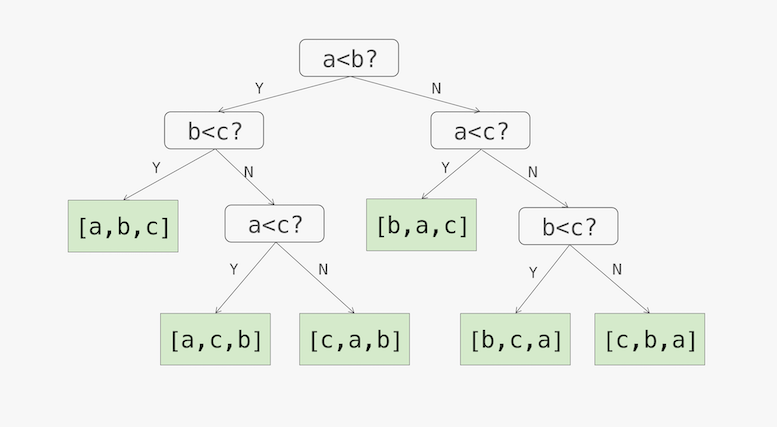

# 十大基本排序算法


| 排序方法       | 时间复杂度（平均）           | 时间复杂度（最坏）           | 时间复杂度（最优）    | 空间复杂度           | 排序位置 | 稳定性      |
| ---------- | ------------------- | ------------------- | ------------ | --------------- | ---- | -------- |
| 冒泡排序（简单交换） | $O(n^2)$            | $O(n^2)$            | $O(n)$       | $O(1)$          | 内部排序 | 稳定       |
| 快速排序       | $O(n\log n)$        | $O(n^2)$            | $O(n\log n)$ | $O(\log n)$（平均） | 内部排序 | 不稳定      |
| 插入排序（简单插入） | $O(n^2)$            | $O(n^2)$            | $O(n)$       | $O(1)$          | 内部排序 | 稳定       |
| 希尔排序       | $O(n\log^2 n)$（有条件） | $O(n\log^2 n)$（有条件） | $O(n)$       | $O(1)$          | 内部排序 | 不稳定      |
| 选择排序（简单选择） | $O(n^2)$            | $O(n^2)$            | $O(n^2)$     | $O(1)$          | 内部排序 | 不稳定      |
| 堆排序        | $O(n\log n)$        | $O(n\log n)$        | $O(n)$       | $O(1)$          | 内部排序 | 不稳定      |
| 归并排序       | $O(n\log n)$        | $O(n\log n)$        | $O(n\log n)$ | $O(n)$          | 外部排序 | 稳定       |
| 计数排序       | $O(n+k)$            | $O(n+k)$            | $O(n+k)$     | $O(n+k)$        | 外部排序 | 稳定       |
| 桶排序        | $O(n)$（有条件）         | $O(n\log n)$（有条件）   | $O(n)$       | $O(n+k)$        | 外部排序 | 稳定（桶内稳定） |
| 基数排序       | $O(k*n)$            | $O(k*n)$            | $O(k*n)$     | $O(n+b)$        | 外部排序 | 稳定       |

说明：
- $n$表示数据规模
- $k$在不同算法中含义不同
	- 计数排序：数据的最大值减最小值
	- 桶排序：桶的个数
	- 基数排序：数字的位数
- $b$在基数排序中表示桶的个数，对于10进制整数，则为10，对于英文字母或其他字符，可以根据种类进行调整
- 计算的**时间复杂度**（最优、平均、最坏）。一般而言，好的性能是${\displaystyle O(n\log n)}$（大O符号），坏的性能是${\displaystyle O(n^{2})}$。对于一个排序理想的性能是${\displaystyle O(n)}$，但平均而言不可能达到。基于比较的排序算法对大多数输入而言至少需要${\displaystyle O(n\log n)}$。
- 稳定性：假设排序前A的位置在B前面，且A与B相等，如果排序之后A仍然在B的前面，则称排序是**稳定的**，否则称排序是**不稳定的**。上表中的稳定性结果是在一般情况的代码实现下得出的，同一个排序算法，不同的实现方式，其稳定性也可能改变。
- 排序位置：如果排序仅在内存中完成，则为**内部排序**。如果数据量太大，还需借助外部存储完成排序，则称为**外部排序**。
- 根据排序方式可以分为比较类非线性时间排序和非比较类线性时间排序：
	- **比较类非线性时间排序方法有**：交换类排序（冒泡排序与快速排序）、插入类排序（简单插入排序与希尔排序）、选择类排序（选择排序与堆排序）、归并排序（二路归并排序和多路归并排序）等。
	- **非比较类线性时间排序方法有**：计数排序、桶排序、基数排序等。（非比较排序是通过确定每个元素之前，应该有多少个元素来排序。非比较排序时间复杂度底，需要占用空间来确定唯一位置，且对数据规模和数据分布有一定的要求。）
- 桶的概念：值得注意的是，在三种非比较排序（计数排序、桶排序和基数排序）中，都有桶的概念，但使用上并不完全相同
	- 计数排序：每个桶存储单一数字
	- 桶排序：桶的个数可以自由控制，每个桶存储一定范围的数值
	- 基数排序：对于整数，桶的个数是10（0-9共10个数字，对于其他字符，则为其种类个数）
- 对于更高效的排序方法，大多是基本排序算法的结合，比如内省排序、Tim排序等，所以掌握了基本排序是十分必要的

## 冒泡排序（Bubble Sort）

冒泡排序是一种简单的排序算法。它重复地遍历要排序的序列，依次比较两个元素，如果它们的顺序错误就把它们交换过来。遍历序列的工作是重复地进行直到没有再需要交换为止，此时说明该序列已经排序完成。这个算法的名字由来是因为越小的元素会经由交换慢慢 “浮” 到数列的顶端。

冒泡排序算法：
1. 比较相邻的元素。如果第一个比第二个大，就交换它们两个。
2. 对每一对相邻元素作同样的工作，从开始第一对到结尾的最后一对。这步做完后，最后的元素会是最大的数。
3. 针对所有的元素重复以上的步骤，在上一次遍历结尾的前一个位置结束。
4. 持续每次对越来越少的元素重复上面的步骤，直到没有任何一对数字需要比较。

对于冒泡排序有一种优化思路是，在下一轮比较时，只需比较到上一轮比较中，最后一次发生交换的位置即可。因为后面的所有元素都没有发生过交换，必然已经有序了。

```java
public int[] bubbleSort(int[] array) {
    for (int i = 1; i < array.length; i++) {
        // Set a flag, if true, that means the loop has not been swapped,
        // that is, the sequence has been ordered, the sorting has been completed.
        boolean flag = true;
        for (int j = 0; j < array.length - i; j++) {
            if (array[j] > array[j + 1]) {
                int tmp = array[j];
                array[j] = array[j + 1];
                array[j + 1] = tmp;
                // Change flag
                flag = false;
            }
        }
        if (flag) {
            break;
        }
    }
    return array;
}
```

**时间复杂度**：平均和最坏情况下，都需要进行两层遍历，所以为$O(n^2)$，最优情况下，则第一次遍历就已经有序，从而跳出循环，所以为$O(n)$。

**空间复杂度**：$O(1)$

**稳定性**：左右两元素相等时不会发生交换，所以排序是稳定的。

## 快速排序（Quick Sort）

快速排序，又称分区交换排序算法，是一种使用分治思想进行排序的算法，应用广泛。

快速排序算法：
1. 从数列中挑出一个元素，称为"基准"（pivot）；
2. 重新排序数列，所有比基准值小的元素摆放在基准前面，所有比基准值大的元素摆在基准后面（相同的数可以到任何一边）。在这个分区结束之后，该基准就处于数列的中间位置。这个称为分区（partition）操作；
3. 递归地把小于基准值元素的子数列和大于基准值元素的子数列排序，直到所有元素有序。

较为常见的优化思路有以下几种：
- 通过“随机取数”或者“三数取中”（即选取第一个、最后一个以及中间的元素中的中位数）的方法来选择两个子序列的分界元素（即比较基准）。这样可以避免极端数据（如升序序列或降序序列）带来的退化。
- 当序列较短时，使用插入排序的效率更高。
- 每趟排序后，将与分界元素相等的元素聚集在分界元素周围，这样可以避免极端数据（如序列中大部分元素都相等）带来的退化。这种优化方法可以称为“三路快速排序”，即找到基准值m后，将待排序数组分为三部分，小于m，等于m，大于m。
- 限制最大递归深度，超过限制后，转为其他排序方式，如转为堆排序。防止在某些极端情况下快排退化为$O(n^2)$。
- 在排序之前先打乱原数组的顺序，防止出现升序或降序的序列带来退化，比如可以直接使用Java的Collections.shuffle()洗牌函数进行打乱。

```java
// quickSort(array, 0, array.length - 1)
public void quickSort(int[] array, int startIndex, int endIndex) {
    if (startIndex < endIndex) {
        int partition = partition(array, startIndex, endIndex);
        quickSort(array, startIndex, partition - 1);
        quickSort(array, partition + 1, endIndex);
    }
}

private int partition(int[] array, int startIndex, int endIndex) {
    int pivot = array[startIndex];
    int left = startIndex;
    int right = endIndex;
    while (left != right) {
        while (left < right && array[right] > pivot) {
            right--;
        }
        while (left < right && array[left] <= pivot) {
            left++;
        }
        if (left < right) {
            swap(array, left, right);
        }
    }
    swap(array, startIndex, left);
    return left;
}

private void swap(int[] array, int i, int j) {
    int tmp = array[i];
    array[i] = array[j];
    array[j] = tmp;
}
```

对于partition操作，还有一种无需借助swap的方式，这种方式左右指针交替前进，左侧或右侧遇到不正确数值时，都进行一次覆盖，而非传统的左右同时遇到不正确值时进行交换，代码如下：

```java
private int partition(int[] array, int startIndex, int endIndex) {
    int pivot = array[startIndex];
    int left = startIndex;
    int right = endIndex;
    while (left != right) {
        while (left < right && array[right] > pivot) {
            right--;
        }
        array[left] = array[right];
        while (left < right && array[left] <= pivot) {
            left++;
        }
        array[right] = array[left];
    }
    array[left] = pivot;
    return left;
}
```

**时间复杂度**：

在最优和平均情况下，可以假定每次分割后，数列被分为相近的长度，在到达数列长度为1的情况时，共进行了$\log n$次迭代，每次迭代都需进行n次比较操作，所以总共的时间复杂度是$O(n \log n)$。

对于最坏情况，可以认为，每次分割后，数列被分为1和n-1的长度，这样迭代次数将变为n次，每次迭代进行n次比较操作，所以时间复杂度为$O(n^2)$。

以上仅是一个简要的分析，详细的证明过程，可以参考：[快速排序（维基百科）](https://zh.wikipedia.org/wiki/%E5%BF%AB%E9%80%9F%E6%8E%92%E5%BA%8F#%E6%AD%A3%E8%A6%8F%E5%88%86%E6%9E%90)和[快速排序（oi-wiki）](https://oi-wiki.org/basic/quick-sort/#%E6%97%B6%E9%97%B4%E5%A4%8D%E6%9D%82%E5%BA%A6)

**空间复杂度**：

对于原地算法，最优和平均情况下，空间复杂度是$O(\log n)$，对于最坏情况则需要n次嵌套，此时空间复杂度为$O(n)$。

对于其他情况，可以参考：[快速排序（维基百科）](https://zh.wikipedia.org/wiki/%E5%BF%AB%E9%80%9F%E6%8E%92%E5%BA%8F#%E7%A9%BA%E9%96%93%E8%A4%87%E9%9B%9C%E5%BA%A6)

**稳定性**：由于排序过程中存在交换操作，所以大部分的快速排序实现，都是不稳定的。

## 插入排序（Insertion Sort）

插入排序是一种简单直观的排序算法。它的原理是首先构建有序序列，对于未排序数据，在已排序序列中从后向前扫描，找到相应位置并插入。插入排序在实现上，通常只需用到$O(1)$的额外空间，因而在从后向前扫描过程中，需要反复把已排序元素逐步向后挪位，为最新元素提供插入空间。

插入排序算法：
1. 从第一个元素开始，该元素可以认为已经被排序
2. 取出下一个元素，在已经排序的元素序列中从后向前扫描
3. 如果该元素（已排序）大于新元素，将该元素移到下一位置
4. 重复步骤3，直到找到已排序的元素小于或者等于新元素的位置
5. 将新元素插入到该位置后
6. 重复步骤2~5

插入排序有一种优化算法，即查找过程替换为二分查找，称为二分插入排序或折半插入排序，找到插入位置后，将数组元素整体向后移动一位后插入。

```java
public int[] insertionSort(int[] array) {
    for (int i = 1; i < array.length; i++) {
        int preIndex = i - 1;
        int current = array[i];
        while (preIndex >= 0 && current < array[preIndex]) {
            array[preIndex + 1] = array[preIndex];
            preIndex -= 1;
        }
        array[preIndex + 1] = current;
    }
    return array;
}
```

**时间复杂度**：平均和最坏情况下，都需要进行两层遍历，所以为$O(n^2)$，最优情况下，列表已经有序，为$O(n)$。

**空间复杂度**：插入是采用逐步挪位的操作，空间复杂度为$O(1)$。

**稳定性**：左右两元素相等时不会发生交换，所以排序是稳定的。

## 希尔排序（Shell Sort）

希尔排序，也称递减增量排序算法，是插入排序的一种更高效的改进版本。希尔排序是基于插入排序的以下两点性质而提出改进方法的：1）插入排序在对几乎已经排好序的数据操作时，效率高，即可以达到线性排序的效率；2）插入排序一般来说是低效的，因为插入排序每次只能将数据移动一位。

希尔排序通过将比较的全部元素分为几个区域来提升插入排序的性能。这样可以让一个元素可以一次性地朝最终位置前进一大步。然后算法再取越来越小的步长进行排序，算法的最后一步就是普通的插入排序，但是到了这步，需排序的数据几乎是已排好的了（此时插入排序较快）。

希尔排序算法：
1. 将待排序数组分为若干子数组（每个子数组的元素在原始数组中间距相同，也即如果间距为d，则元素索引对d取模的值相同）；
2. 对这些子数组进行插入排序；
3. 减小划分子数组的间距值，重复上述过程直至间距减少为1，完成排序。

需要说明的是，间距序列的选取，直接决定了算法的执行效果，即不同的时间复杂度。希尔本人建议的间距序列是初始值为$len/2$（len为数组长度），然后下一次间距值为上一次的$1/2$，直到间距为1停止。但需要注意的是，这个间距序列并非最高效率的间距序列。

```java
public int[] shellSort(int[] array) {
    int n = array.length;
    int gap = n / 2;
    while (gap > 0) {
        for (int i = gap; i < n; i++) {
            int current = array[i];
            int preIndex = i - gap;
            // Insertion sort
            while (preIndex >= 0 && array[preIndex] > current) {
                array[preIndex + gap] = array[preIndex];
                preIndex -= gap;
            }
            array[preIndex + gap] = current;
        }
        gap /= 2;
    }
    return array;
}
```

**为什么希尔排序可以突破$O(n^2)$的复杂度，获得比插入排序更好的执行效率呢？**

首先，在数组中的两个数字，如果前面一个数字大于后面的数字，则这两个数字组成一个逆序对。

一个随机数组，逆序对的数量是$O(n^2)$级别的，对于交换相邻元素的算法，则只能消除一个逆序对，而希尔排序交换了间隔较远的元素，每次消除的逆序对数量也就大于1了，因此效率就得到了提升。其他突破$O(n^2)$级别，达到$O(n \log n)$级别的算法，本质也是因为交换了间隔较远的元素。

**时间复杂度**：

对于本身有序的数组，且间距序列只有1，希尔排序退化为插入排序，即最优的复杂度为$O(n)$。

对于其他的间距序列，其时间复杂度的分析十分复杂，可以参考：[希尔排序](https://oi-wiki.org/basic/shell-sort/#%E6%97%B6%E9%97%B4%E5%A4%8D%E6%9D%82%E5%BA%A6)。仅展示结论供参考（注意取值时，要以最终计算的结果按从大到小的顺序排列后使用）：

- 若间距序列为$\{ n/2^i\mid i=1,2,\ldots,\lfloor\log_2 n\rfloor \}$，则希尔排序算法的时间复杂度为$O(n^2)$。
- 若间距序列为$\{ 2^k-1\mid k=1,2,\ldots,\lfloor\log_2 n\rfloor \}$，则希尔排序算法的时间复杂度为$O(n^{3/2})$。
- 若间距序列为$\{ k=2^p\cdot 3^q\mid p,q\in \mathbb N,k\le n \}$，则希尔排序算法的时间复杂度为$O(n\log^2 n)$。

**空间复杂度**：本质是分组的插入排序，不占用额外空间，因此空间复杂度为$O(1)$。

**稳定性**：在不同间距之间的元素中进行移位操作，会造成排序不稳定。

## 选择排序（Selection Sort）

选择排序是一种简单直观的排序算法，无论什么情况都是$O(n^2)$的时间复杂度。它的工作原理：首先在未排序序列中找到最小（大）元素，存放到排序序列的起始位置，然后，再从剩余未排序元素中继续寻找最小（大）元素，然后放到已排序序列的末尾。以此类推，直到所有元素均排序完毕。

选择排序算法：
1. 首先在未排序序列中找到最小（大）元素，存放到排序序列的起始位置
2. 再从剩余未排序元素中继续寻找最小（大）元素，然后放到已排序序列的末尾。
3. 重复第 2 步，直到所有元素均排序完毕。

对于选择排序，有一种优化思路，即每次遍历同时查找最大元素和最小元素，将其放置在队首和队尾，这样可以减小一半的遍历次数。并且，当某一轮遍历出现最大值和最小值相等，表示数组中剩余元素已经全部相等，则可以停止。

```java
public static int[] selectionSort(int[] array) {
    for (int i = 0; i < array.length - 1; i++) {
        int minIndex = i;
        for (int j = i + 1; j < array.length; j++) {
            if (array[j] < array[minIndex]) {
                minIndex = j;
            }
        }
        if (minIndex != i) {
            int tmp = array[i];
            array[i] = array[minIndex];
            array[minIndex] = tmp;
        }
    }
    return array;
}
```

**时间复杂度**：在任何情况下，找到当前遍历的最小（大）元素都需要检查所有元素，因此时间复杂度都是$O(n^2)$。

**空间复杂度**：不需要引入额外空间，因此为$O(1)$。

**稳定性**：由于确定完最小（大）元素后，需要交换已排序序列的末尾与最值元素，如果末尾的元素在序列中存在值相等的元素，就可能造成排序不稳定。

## 堆排序（Heap Sort）

堆排序是指利用堆这种数据结构所设计的一种排序算法。堆的性质：即子节点的值总是小于（或者大于）它的父节点。

以升序排序说明，首先把数组转换成最大堆（子节点小于父节点），重复从最大堆取出数值最大的根结点（把根结点和最后一个结点交换，把交换后的最后一个结点移出堆），并让剩余的堆维持最大堆的性质，最后则得到排序数组。

堆排序算法：
1. 首先将数组转换为最大堆；
2. 将堆顶的节点取出，作为最大值，并将堆的最后一个节点放在原来堆顶位置，并调整剩余堆节点为最大堆；
3. 重复步骤2，在第n-1次操作后，整个数组就完成了排序。

```java
public int[] heapSort(int[] array) {
    // Build MaxHeap
    // First non leaf node: array.length / 2 - 1
    for (int i = array.length / 2 - 1; i >= 0; i--) {
        heapify(array, i, array.length);
    }

    // sort
    int heapLen = array.length;
    for (int i = array.length - 1; i > 0; i--) {
        // Move the top of the heap to the tail of the heap in turn
        swap(array, 0, i);
        heapify(array, 0, --heapLen);
    }
    
    return array;
}

/**
 * Maximum heap: from top to down
 *
 * @param array
 * @param i
 */
private void heapify(int[] array, int i, int heapLen) {
    int left = 2 * i + 1;
    int right = 2 * i + 2;
    int largest = i;
    if (right < heapLen && array[right] > array[largest]) {
        largest = right;
    }
    if (left < heapLen && array[left] > array[largest]) {
        largest = left;
    }
    if (largest != i) {
        swap(array, largest, i);
        heapify(array, largest, heapLen);
    }
}

/**
 * Swap
 *
 * @param array
 * @param i
 * @param j
 */
private void swap(int[] array, int i, int j) {
    int tmp = array[i];
    array[i] = array[j];
    array[j] = tmp;
}
```

**时间复杂度**：堆排序一共有两步，第一步是建堆，第二步是堆排序。

1）建堆的时间复杂度：$O(n)$（具体分析过程可参考 06堆-堆的创建）

2）堆排序的时间复杂度：

如果堆中所有节点的值相同，则每次取当前堆中最大节点并重新调整堆的过程都可以在$O(1)$时间内完成，所以最优情况下，时间复杂度是$O(n)$。

对于一般情况（适用于平均和最坏，平均情况可在最坏情况下折半，但复杂度级别不变），对于每次取出最大节点后，会把最后的节点放在堆顶，并自上向下重新调整堆，共调整h-1次，即$\log n$次，于是有：
- 第一个节点，调整$\log (n-1)$次；
- 第二个节点，调整$\log (n-2)$次；
- ...
- 第n-1个节点，调整$\log 1$次；
- 第n个节点，调整0次；

对其求和

$$S=\log (n-1) + \log (n-2) +...+ \log 2 + \log 1$$
$$S=\log ((n-1)!) $$
$$S \sim \log (n!) $$
应用斯特林公式：$n!\sim \sqrt{2\pi n} \left ( n/e \right) ^{n}$

化简后可以得出

$$S \sim O(n \log n) + O(n) + O(\log n) + O(1) \sim O(n \log n)$$

综上，建堆操作时间复杂度是$O(n)$，而堆排序的时间复杂度是$O(n\log n)$，所以综合时间复杂度是$O(n\log n)$。

**空间复杂度**：堆排序是一种原地算法，未引入额外数据存储，所以空间复杂度为$O(1)$。

**稳定性**：同选择排序一样，由于其中交换位置的操作，所以是不稳定的排序算法。

## 归并排序（Merge Sort）

约翰·冯·诺伊曼在 1945 年提出了归并排序。归并排序是建立在归并操作上的一种有效的排序算法。该算法是采用分治法 (Divide and Conquer) 的一个非常典型的应用。归并排序是一种稳定的排序方法。将已有序的子序列合并，得到完全有序的序列，即先使每个子序列有序，再使子序列段间有序。若将两个有序表合并成一个有序表，称为2-路归并，N个有序表称为N-路归并。

和选择排序一样，归并排序的性能不受输入数据的影响，但表现比选择排序好的多，因为始终都是$O(nlogn)$的时间复杂度。代价是需要额外的内存空间。

归并排序算法是一个递归过程，以2-路归并为例，具体过程如下：
1. 如果输入内只有一个元素，则直接返回，否则将长度为 n 的输入序列分成两个长度为 n/2 的子序列；
2. 分别对这两个子序列进行归并排序，使子序列变为有序状态；
3. 设定两个指针，分别指向两个已经排序子序列的起始位置；
4. 比较两个指针所指向的元素，选择相对小的元素放入到合并空间（用于存放排序结果），并移动指针到下一位置；
5. 重复步骤 3 ~ 4 直到某一指针达到序列尾；
6. 将另一序列剩下的所有元素直接复制到合并序列尾。

```java
public int[] mergeSort(int[] array) {
    if (array.length <= 1) {
        return array;
    }
    int middle = array.length / 2;
    int[] arr1 = Arrays.copyOfRange(array, 0, middle);
    int[] arr2 = Arrays.copyOfRange(array, middle, array.length);
    // Merge two sorted arrays
    return merge(mergeSort(arr1), mergeSort(arr2));
}

private int[] merge(int[] arr1, int[] arr2) {
    int[] sortedArr = new int[arr1.length + arr2.length];
    int idx = 0, idx1 = 0, idx2 = 0;
    while (idx1 < arr1.length && idx2 < arr2.length) {
        if (arr1[idx1] < arr2[idx2]) {
            sortedArr[idx] = arr1[idx1];
            idx1 += 1;
        } else {
            sortedArr[idx] = arr2[idx2];
            idx2 += 1;
        }
        idx += 1;
    }
    if (idx1 < arr1.length) {
        while (idx1 < arr1.length) {
            sortedArr[idx] = arr1[idx1];
            idx1 += 1;
            idx += 1;
        }
    } else {
        while (idx2 < arr2.length) {
            sortedArr[idx] = arr2[idx2];
            idx2 += 1;
            idx += 1;
        }
    }
    return sortedArr;
}
```

**时间复杂度**：

假设我们需要对一个包含n个数的序列使用归并排序，那么过程如下：
- 递归的第一层，将n个数划分为2个子区间，每个子区间的数字个数为n/2；
- 递归的第二层，将n个数划分为4个子区间，每个子区间的数字个数为n/4；
- ......
- 递归的第$\log n$层，将n个数划分为n个子区间，每个子区间的数字个数为1；

我们知道，归并排序的过程中，需要对当前区间进行对半划分，直到区间的长度为1。也就是说，每一层的子区间，长度都是上一层的1/2。这也就意味着，当划分到第$\log n$层的时候，子区间的长度就是1了。

而归并排序的merge操作，则是从最底层开始（子区间为1的层），对相邻的两个子区间进行合并，过程如下：
- 在第$\log n$层（最底层），每个子区间的长度为1，共n个子区间，每相邻两个子区间进行合并，总共合并n/2次。n个数字都会被遍历一次，所有这一层的总时间复杂度为$O(n)$；
- ......
- 在第二层，每个子区间长度为n/4，总共有4个子区间，每相邻两个子区间进行合并，总共合并2次。n个数字都会被遍历一次，所以这一层的总时间复杂度为$O(n)$；
- 在第一层，每个子区间长度为n/2，总共有2个子区间，只需要合并一次。n个数字都会被遍历一次，所以这一层的总时间复杂度为$O(n)$；

通过上面的过程我们可以发现，对于每一层来说，在合并所有子区间的过程中，n个元素都会被操作一次，所以每一层的时间复杂度都是$O(n)$。而之前我们说过，归并排序划分子区间，将子区间划分为只剩1个元素，需要划分$\log n$次。每一层的时间复杂度为$O(n)$，共有$\log n$层，所以归并排序的时间复杂度就是$O(n\log n)$。

**空间复杂度**：因为归并过程申请了长度为n的临时数组，所以空间复杂度为$O(n)$。

**稳定性**：在merge操作中，取值相同的数，无论在同一区间，还是不同区间，都会按原来顺序进行排序，所以排序是稳定的。

## 计数排序（Counting Sort）

计数排序不是比较排序，而是一种线性时间复杂度的排序，因此不被$O(n\log n)$的下界限制。其通过额外数组C，保存某个元素在原数组A中出现的次数，来推算出排序后的位置，并保存在结果数组R中，因而要求输入的数据必须是有确定范围的整数。计数排序是一种稳定的排序算法。

计数排序算法：
1. 找出数组中的最大值$max$、最小值$min$；
2. 创建一个新的计数数组C，其长度是$max-min+1$，其元素默认值都为0；
3. 遍历原数组A中的元素$A[i]$，以$A[i]-min$作为C数组的索引，以$A[i]$的值在A中元素出现次数作为$C[A[i]-min]$的值；
4. 对C数组变形，新元素的值是该元素与前一个元素值的和，即当$i>1$，时$C[i]=C[i]+C[i-1]$；
5. 创建结果数组R，长度和原始数组一样；
6. **从后向前**遍历原始数组A中的元素$A[i]$，使用$A[i]-min$作为索引，在计数数组C中找到对应的值$C[A[i]-min]$，$C[A[i]-min]-1$就是$A[i]$在结果数组R中的位置，做完上述这些操作，将$C[A[i]-min]$减小1。

需要注意，计数排序由于创建的C数组大小是数组元素值的范围，所以**只适用于范围不大的数组**。比如int[] arr = new int[]{1, Integer.MAX_VALUE};虽然数组中只有两个元素，但其$max-min+1$范围非常大，如果直接创建C数组，会发生内存不足的报错。

```java
public int[] countingSort(int[] array) {
    if (array.length < 2) {
        return array;
    }
    int[] extremum = getMinAndMax(array);
    int minValue = extremum[0];
    int maxValue = extremum[1];
    int[] count = new int[maxValue - minValue + 1];
    int[] result = new int[array.length];

    for (int i = 0; i < array.length; i++) {
        count[array[i] - minValue] += 1;
    }
    for (int i = 1; i < count.length; i++) {
        count[i] += count[i - 1];
    }
    for (int i = array.length - 1; i >= 0; i--) {
        int idx = count[array[i] - minValue] - 1;
        result[idx] = array[i];
        count[array[i] - minValue] -= 1;
    }
    return result;
}

/**
 * Gets the maximum and minimum values in the array
 * 
 * @param array
 * @return
 */
private int[] getMinAndMax(int[] array) {
    int maxValue = array[0];
    int minValue = array[0];
    for (int i = 0; i < array.length; i++) {
        if (array[i] > maxValue) {
            maxValue = array[i];
        } else if (array[i] < minValue) {
            minValue = array[i];
        }
    }
    return new int[]{minValue, maxValue};
}
```

**为什么计数排序可以突破$O(n\log n)$的下界限，而达到$O(n)$级别呢？**

首先考虑决策树，它是一棵完全二叉树，可以反映比较排序算法中对所有元素的比较操作。这棵决策树上的每一个叶结点都对应了一种可能的排列，从根结点到任意一个叶结点之间的最短路径（或简单路径），表示完成对应排列的比较次数。从根结点到叶结点之间的最长简单路径的长度，表示比较排序算法中最坏情况下的比较次数。



设决策树的高度为$h$，叶结点的数量为$l$，排序元素总数为$n$ 。

从排列组合角度，叶结点最多有$n!$个，为叶节点个数的下限，所以$n!≤l$；

从二叉树的角度，高度为$h$的二叉树，叶结点的数量最多为$2^h$，为叶节点个数的上限，所以有$l≤2^h$；

综上可得$n!≤l≤2^h$，对该式两边取对数，有$h ≥ \log (n!)$，带入斯特林（Stirling）近似公式$\log (n!)=O(n \log n)$，可得$h ≥ \log (n!)=O(n \log n)$。

于是得出以下定理和推论：

> 《算法导论》定理8.1：在最坏情况下，任何比较排序算法都需要做$O(n \log n)$次比较。
> 
> 《算法导论》推论8.2：堆排序和归并排序都是渐进最优的比较排序算法。

再来看计数排序，假设其申请了长度为k的计数数组，在遍历每一个数字时，此数字落在计数数组中的可能性共有k种，但通过数字本身的大小属性，可以一次把它放到正确的位置上。相当于一次排除了$(k−1)/k$种可能性。这就是计数排序算法比基于比较的排序算法更快的根本原因。

由此可以得出结论，基于比较进行排序，复杂度下限为$O(n \log n)$。计数排序和基于比较的排序算法相比，根本区别就在于，**计数排序不是基于比较的排序算法，而是利用了数字本身的大小属性来进行排序的**，因此才达到了$O(n)$的复杂度。

**时间复杂度**：计数排序一种线性时间复杂度的排序，仅与待排序数组规模n和数组的取值范围k有关，因此其时间复杂度为$O(n+k)$。

**空间复杂度**：只存储待排序数组A、计数数组C、结果数组R，因此其空间复杂度为$O(n+k)$。

**稳定性**：由于计数排序的最后一步是从后向前遍历原数组，对于相同值的元素，靠后的元素依旧会放在结果数组中靠后的位置，所以排序是稳定的。

## 桶排序（Bucket Sort）

桶排序算是计数排序的一种改进和推广。桶排序（或箱排序），工作的原理是将数组分到有限数量的桶里，每个桶之间也应该有大小顺序，并对每个桶再分别排序（有可能使用别的排序算法，如插入排序，或是以递归方式继续使用桶排序进行排序）。

桶排序算法：
1. 设置k个空桶，一般选取一个间隔值gap，并计算数组中最大值与最小值的差值，去除gap，则得出桶的个数k；（或者也可以直接设置桶个数k，并反过来推导出gap的大小，有了gap大小，才能方便计算每个元素应该落入哪个桶中）
2. 遍历输入数据，并且把数据依次映射（映射算法需要保证桶之间大小有序）到对应的桶里去；
3. 对每个非空的桶进行排序，可以使用其它排序方法，如插入排序，也可以递归使用桶排序；
4. 从非空桶里把排好序的数据拼接起来。

这里有一点需要注意，桶的数据结构应该设置为数组还是链表呢？如果设置为数组，为了避免极端情况（所有数据都在同一个桶）需要将数组的大小设置为待排序数组的大小，这样无疑是一种空间的浪费，如果设置为链表，则对链表排序（如快排）则访问元素的效率将会降低，无法进行随机访问。因此，可以考虑如下解决思路，如果使用数组，可以通过初始设置一个小容量，再动态扩容的方式来避免空间浪费，如果使用链表，可以在排序阶段将其转为数组进行排序（如果直接调用Java的Collections.sort对list进行排序，其实现上首先也是将list转为array）。

```java
public List<Integer> bucketSort(List<Integer> array, int gap) {
    if (array.size() < 2 || gap == 0) {
        return array;
    }

    int[] extremum = getMinAndMax(array);
    int minValue = extremum[0];
    int maxValue = extremum[1];
    int bucketSize = (maxValue - minValue) / gap + 1;
    List<List<Integer>> buckets = new ArrayList<>();
    for (int i = 0; i < bucketSize; i++) {
        buckets.add(new ArrayList<>());
    }

    for (int element : array) {
        int idx = (element - minValue) / gap;
        buckets.get(idx).add(element);
    }

    for (int i = 0; i < buckets.size(); i++) {
        if (buckets.get(i).size() > 1) {
            // Recursive call
            // buckets.set(i, bucketSort(buckets.get(i), bucketSize / 2));
            // or other sorting algorithms
            Collections.sort(buckets.get(i));
        }
    }

    ArrayList<Integer> result = new ArrayList<>();
    for (List<Integer> bucket : buckets) {
        for (int element : bucket) {
            result.add(element);
        }
    }

    return result;
}
```

**时间复杂度**：

最优情况下，也即k（桶数）与n（数组元素个数）相等时，每个桶中只有一个元素，直接有序，故复杂度为$O(n)$。

最坏情况下，也即所有元素都在一个桶内，如果桶内使用$O(n^2)$的算法，如插入排序，则复杂度为$O(n^2)$，如果使用$O(n\log n)$的算法，如快排，则复杂度为$O(n\log n)$。

平均情况下，n个元素，均匀分布在k个桶中，那么每个桶的元素个数为$m= n/k$，桶内使用$O(n\log n)$的算法，如快排，则时间复杂度为$O(m \log m)$，即$O((n/k)* \log (n/k))$，那k个桶就是$O(n \log (n/k)))$，如果取$k=O(n)$，那么$\log (n/k))$则为常数，所以最终的时间复杂度为$O(n)$。

**空间复杂度**：存储桶内元素以及最后结果的空间为$O(n)$，每个桶内使用空间复杂度为$O(1)$的算法，如插入排序，则空间为$k*O(1)$，即$O(k)$，所以总体空间复杂度为$O(n+k)$。

**稳定性**：如果使用稳定的内层排序，并且将元素插入桶中时不改变元素间的相对顺序，那么桶排序就是一种稳定的排序算法。由于每块元素不多，一般使用插入排序。此时桶排序是一种稳定的排序算法。

## 基数排序（Radix Sort）

基数排序是一种针对整数的非比较排序算法，其原理是将整数按位数切割成不同的数字，然后从低位到高位分别比较，然后收集，直至最高位。由于整数也可以表达字符串（比如名字或日期）和特定格式的浮点数，所以基数排序也不是只能应用于整数。

基数排序算法：
1. 取得数组中的最大数，并取得位数，即为迭代次数k（例如：数组中最大数值为 1000，则 k=4）；
2. 设置空的radix数组10个（0-9共10个不同数字，如果是字符串或其他，可以根据字符种类进行调整）；
3. 从最低位开始，对原始数组进行遍历，取每个元素当前位的数值，依其数值存入radix数组；
4. 将radix依次赋值给原数组；
5. 重复2~4步骤k次

上述排序过程是从低位到高位的，这种方式处理起来更加方便，称为“低位优先法”。相应的，如果从高位到低位进行排序，则称为“高位优先法”，这两种方法都可以得到最终排序结果。

如果对含有负整数列表进行排序呢？我们首先想到可以增加一个大的正数，使列表所有数都为正，但这样容易发生越界。一种较好的方式是，将某一位上的-9~9映射到一个长度为19的数组上，即0对应-9，18对应9，然后进行后续操作即可。

```java
public int[] radixSort(int[] array) {
    if (array.length < 2) {
        return array;
    }

    int maxValue = array[0];
    for (int element : array) {
        if (element > maxValue) {
            maxValue = element;
        }
    }

    int k = 1;
    while (maxValue / 10 != 0) {
        maxValue = maxValue / 10;
        k += 1;
    }
    for (int i = 0; i < k; i++) {
        List<List<Integer>> radix = new ArrayList<>();
        for (int b = 0; b < 10; b++) {
            radix.add(new ArrayList<>());
        }
        for (int element : array) {
            int idx = (element / (int) Math.pow(10, i)) % 10;
            radix.get(idx).add(element);
        }
        int idx = 0;
        for (List<Integer> list : radix) {
            for (int element : list) {
                array[idx++] = element;
            }
        }
    }
    return array;
}
```

**时间复杂度**：基数排序的时间复杂度是恒定的，是位数k和n的乘积，即$O(k*n)$。

**空间复杂度**：共使用了b个桶（每一位有0-9共10个数字，共10个桶），以及n个数字的空间，所以空间复杂度为$O(n+b)$。

**稳定性**：基数排序基于分别排序，分别收集，相同元素之间可以保证顺序永远不变，所以是稳定的。

参考：
1. [wiki：排序算法](https://zh.wikipedia.org/wiki/%E6%8E%92%E5%BA%8F%E7%AE%97%E6%B3%95)
2. [wiki: Sorting algorithm](https://en.wikipedia.org/wiki/Sorting_algorithm)
3. [十大经典排序算法总结](https://javaguide.cn/cs-basics/algorithms/10-classical-sorting-algorithms.html)
4. [排序简介](https://oi-wiki.org/basic/sort-intro/)
5. [leetcode：排序算法](https://leetcode.cn/leetbook/read/sort-algorithms/evkca6/)
6. [三种快速排序以及快速排序的优化](https://blog.csdn.net/insistGoGo/article/details/7785038)
7. [快速排序和归并排序的时间复杂度分析——通俗易懂](https://www.cnblogs.com/tuyang1129/p/12857821.html)
8. [堆排序的时间和空间复杂度](https://juejin.cn/post/7119807721766912030)
