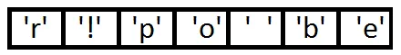
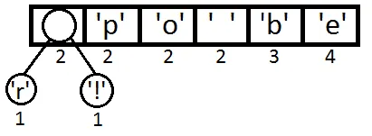
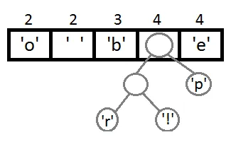
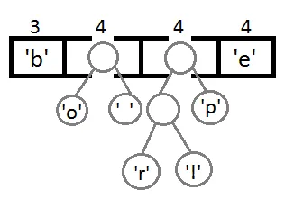
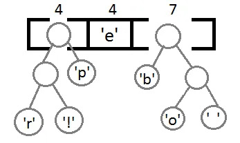
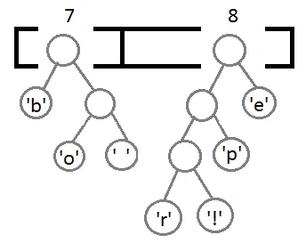
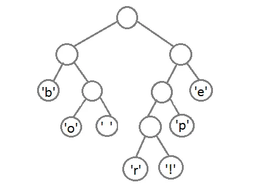
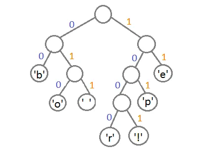

# 霍夫曼编码


霍夫曼编码（Huffman Coding），又译为哈夫曼编码、赫夫曼编码，是一种用于无损数据压缩的熵编码（权编码）算法。由美国计算机科学家大卫·霍夫曼于1952年发明。

霍夫曼编码使用变长编码表对字符进行编码，其中变长编码表是通过一种评估字符出现概率的方法得到的，出现概率高的字母使用较短的编码，反之出现概率低的则使用较长的编码，这便使编码之后的字符串的平均长度降低，从而达到无损压缩数据的目的。

如果我们需要来压缩下面的字符串：

```
beep boop beer!
```

首先，我们先计算出每个字符出现的次数，我们得到下面这样一张表：

| 字符  | 次数  |
| --- | --- |
| 'b' | 3   |
| 'e' | 4   |
| 'p' | 2   |
| ' ' | 2   |
| 'o' | 2   |
| 'r' | 1   |
| '!' | 1   |

然后，我把把这些东西放到 Priority Queue 中（用出现的次数据当 priority），我们可以看到，Priority Queue 是以 Prioirry 排序一个数组，如果 Priority 一样，会使用出现的先后顺序排序。下面是我们得到的 Priority Queue：



接下来就是我们的算法——把这个 Priority Queue 转成二叉树。我们始终从 queue 的头取两个元素来构造一个二叉树（第一个元素是左结点，第二个是右结点），并把这两个元素的 Priority 相加，并放回 Priority 中（再次注意，这里的 Priority 就是字符出现的次数），然后我们得到下面的数据图表：



同样，我们再把前两个取出来，形成一个 Priority 为 4(2+2) 的结点，然后再放回 Priority Queue 中：



继续我们的算法（我们可以看到，这是一种自底向上的建树的过程）：







最终我们会得到下面这样一棵二叉树：



此时，我们把这个树的左支编码为 0，右支编码为 1，这样我们就可以遍历这棵树得到字符的编码，比如：'b'的编码是 00，'p'的编码是 101，'r'的编码是 1000。**我们可以看到出现频率越多的会越在上层，编码也越短，出现频率越少的就越在下层，编码也越长**。



最终我们可以得到下面这张编码表：

| 字符  | 编码   |
| --- | ---- |
| 'b' | 00   |
| 'e' | 11   |
| 'p' | 101  |
| ' ' | 011  |
| 'o' | 010  |
| 'r' | 1000 |
| '!' | 1001 |

这里需要注意一点，当我们编码的时候，我们是按 bit 来编码，解码也是通过 bit 来完成，比如，如果我们有这样的 bitset 1011110111 那么其解码后就是 "pepe"。所以，我们需要通过这个二叉树建立我们 Huffman 编码和解码的字典表。

这里需要注意的一点是，我们的 Huffman 对各个字符的编码是不会冲突的，也就是说，不会存在某一个编码是另一个编码的前缀，不然的话就会大问题了。因为编码后的编码是没有分隔符的。

最后，对于我们的原始字符串：beep boop beer!

对应的二进制为 : 0110 0010 0110 0101 0110 0101 0111 0000 0010 0000 0110 0010 0110 1111 0110 1111 0111 0000 0010 0000 0110 0010 0110 0101 0110 0101 0111 0010 0010 0001

对应的 Huffman 的编码为： 0011 1110 1011 0001 0010 1010 1100 1111 1000 1001

节省了三分之二的空间占用。

使用Java实现：

```java
import java.util.HashMap;
import java.util.Map;
import java.util.PriorityQueue;

public class HuffmanExample {
    // 1. 统计字符频率
    public static Map<Character, Integer> buildFrequencyMap(String text) {
        Map<Character, Integer> frequencyMap = new HashMap<>();
        for (char c : text.toCharArray()) {
            frequencyMap.put(c, frequencyMap.getOrDefault(c, 0) + 1);
        }
        return frequencyMap;
    }

    // 2. 利用最小堆构造 Huffman 树
    public static HuffmanNode buildHuffmanTree(Map<Character, Integer> freqMap) {
        PriorityQueue<HuffmanNode> pq = new PriorityQueue<>();
        // 将每个字符都作为一个叶子节点放入最小堆
        for (Map.Entry<Character, Integer> entry : freqMap.entrySet()) {
            pq.offer(new HuffmanNode(entry.getKey(), entry.getValue()));
        }

        // 直到堆中只剩下一个节点时，堆顶就是 Huffman 树的根节点
        while (pq.size() > 1) {
            HuffmanNode left = pq.poll();
            HuffmanNode right = pq.poll();

            // 创建一个新的父节点，频率是左右子树之和
            HuffmanNode parent = new HuffmanNode('\0', left.frequency + right.frequency);
            parent.left = left;
            parent.right = right;
            pq.offer(parent);
        }

        return pq.poll();
    }

    // 3. 生成 Huffman 编码表
    public static void buildCodeMap(HuffmanNode root, StringBuilder sb, Map<Character, String> codeMap) {
        if (root == null) {
            return;
        }
        // 叶子节点，记录编码
        if (root.left == null && root.right == null) {
            codeMap.put(root.ch, sb.toString());
            return;
        }
        // 左分支添加 '0'
        sb.append('0');
        buildCodeMap(root.left, sb, codeMap);
        sb.deleteCharAt(sb.length() - 1);

        // 右分支添加 '1'
        sb.append('1');
        buildCodeMap(root.right, sb, codeMap);
        sb.deleteCharAt(sb.length() - 1);
    }

    // 4. 对文本进行编码
    public static String encode(String text, Map<Character, String> codeMap) {
        StringBuilder encoded = new StringBuilder();
        for (char c : text.toCharArray()) {
            encoded.append(codeMap.get(c));
        }
        return encoded.toString();
    }

    // 5. 解码
    public static String decode(String encodedText, HuffmanNode root) {
        StringBuilder sb = new StringBuilder();
        HuffmanNode current = root;
        for (char bit : encodedText.toCharArray()) {
            if (bit == '0') {
                current = current.left;
            } else {
                current = current.right;
            }
            // 到达叶子节点，输出字符
            if (current.left == null && current.right == null) {
                sb.append(current.ch);
                current = root;
            }
        }
        return sb.toString();
    }

    public static void main(String[] args) {
        // 测试字符串
        String text = "beep boop beer!";
        System.out.println("原始字符串: " + text);

        // 1. 构造频率表
        Map<Character, Integer> frequencyMap = buildFrequencyMap(text);

        // 2. 构造 Huffman 树
        HuffmanNode root = buildHuffmanTree(frequencyMap);

        // 3. 构造 Huffman 编码表
        Map<Character, String> codeMap = new HashMap<>();
        buildCodeMap(root, new StringBuilder(), codeMap);

        // 打印每个字符的 Huffman 编码
        System.out.println("Huffman 编码表:");
        for (Map.Entry<Character, String> entry : codeMap.entrySet()) {
            System.out.println("'" + entry.getKey() + "' -> " + entry.getValue());
        }

        // 4. 编码
        String encoded = encode(text, codeMap);
        System.out.println("\nHuffman 编码后: " + encoded);

        // 原始数据与编码后数据长度对比(按 bit 计算)
        int originalLength = text.length() * 8;      // 每个 char 占 8 bit
        int compressedLength = encoded.length();    // Huffman 编码后仅是比特串长度
        System.out.println("原始数据长度(比特) : " + originalLength);
        System.out.println("压缩后数据长度(比特): " + compressedLength);
        double ratio = (1 - (double) compressedLength / originalLength) * 100;
        System.out.printf("压缩比例: %.2f%%\n", ratio);

        // 5. 解码
        String decoded = decode(encoded, root);
        System.out.println("\n解码后字符串: " + decoded);
    }

    // Huffman 树的节点
    static class HuffmanNode implements Comparable<HuffmanNode> {
        char ch;                  // 叶子节点所代表的字符
        int frequency;            // 该字符出现的频率
        HuffmanNode left, right;  // 左右子节点

        HuffmanNode(char ch, int frequency) {
            this.ch = ch;
            this.frequency = frequency;
        }

        @Override
        public int compareTo(HuffmanNode o) {
            // 优先队列根据频率从小到大排序
            return this.frequency - o.frequency;
        }
    }
}
```

输出：

```
原始字符串: beep boop beer!
Huffman 编码表:
' ' -> 010
'p' -> 011
'!' -> 1010
'b' -> 00
'r' -> 1011
'e' -> 11
'o' -> 100

Huffman 编码后: 0011110110100010010001101000111110111010
原始数据长度(比特) : 120
压缩后数据长度(比特): 40
压缩比例: 66.67%

解码后字符串: beep boop beer!
```

**参考：**

1. [霍夫曼编码](https://zh.wikipedia.org/wiki/%E9%9C%8D%E5%A4%AB%E6%9B%BC%E7%BC%96%E7%A0%81)
2. [Huffman 编码压缩算法](https://coolshell.cn/articles/7459.html)
