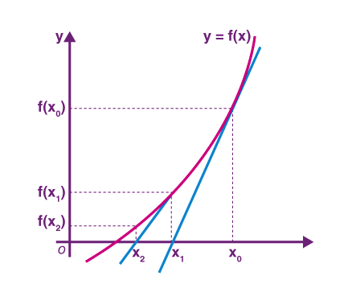

# 牛顿迭代法


牛顿迭代法或牛顿法，它是一种在实数域和复数域上近似求解方程的方法。方法使用函数${\displaystyle f(x)}$的泰勒级数的前面几项来寻找方程${\displaystyle f(x)=0}$的根。

初始时我们从给定的$f(x)$和一个近似解$x_0$开始，假设我们目前的近似解是$x_i$，我们画出与$f(x)$切于点$(x_i,f(x_i))$的直线$l$，将$l$与$x$轴的交点横坐标记为$x_{i+1}$，那么这就是一个更优的近似解，重复这个迭代的过程，将逐渐逼近方程的解。 



根据导数的几何意义，可以得到如下关系：
$$f'(x_i) = \frac{f(x_i)}{x_{i} - x_{i+1}}$$
整理后得到如下递推式：
$$x_{i+1} = x_i - \frac{f(x_i)}{f'(x_i)}$$
直观地说，如果$f(x)$比较平滑，那么随着迭代次数的增加，$x_i$会越来越逼近方程的解。牛顿迭代法的收敛率是平方级别的，这意味着每次迭代后近似解的精确数位会翻倍。

以求一个数的平方根为例进行说明，对于求数$C$的平方根，等同于求解函数$f(x)=x^2-C$等于0的根。根据递推公式，可以得到：
$$x_{i+1} = x_i - \frac{x_i^2-C}{2x_i}=\frac{x_i}{2} + \frac{C}{2x_i}$$

```java
public int newtonSqrt(int c) {
    if (c == 0 || c == 1) {
        return c;
    }

    double x0 = c;
    while (true) {
        double x1 = 0.5 * (x0 + c / x0);
        if (Math.abs(x1 - x0) < 1e-7) {
            break;
        }
        x0 = x1;
    }
    return (int) x0;
}
```

参考：
1. [牛顿迭代法](https://oi-wiki.org/math/numerical/newton/)（收录了收敛证明以及相关缺陷的参考文献）
2. [Newton Raphson Method](https://byjus.com/maths/newton-raphson-method/)
