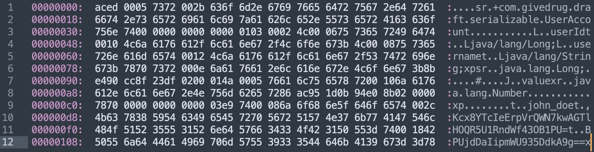

# （问题）序列化对某个字段加密或解密？


在序列化过程中如果要对某个字段进行加密或解密，可以通过重写writeObject()和readObject()方法来实现。

加解密工具类：

```java
import javax.crypto.Cipher;
import javax.crypto.SecretKey;
import javax.crypto.spec.SecretKeySpec;
import java.util.Base64;

public class CryptoUtils {

    private static final String AES_KEY = "1234567890ABCDEF"; // 16 字节示例密钥
    private static final String ALGORITHM = "AES";

    public static String encrypt(String plainText) throws Exception {
        if (plainText == null) return null;
        SecretKey secretKey = new SecretKeySpec(AES_KEY.getBytes(), ALGORITHM);
        Cipher cipher = Cipher.getInstance(ALGORITHM);
        cipher.init(Cipher.ENCRYPT_MODE, secretKey);
        byte[] encryptedBytes = cipher.doFinal(plainText.getBytes("UTF-8"));
        return Base64.getEncoder().encodeToString(encryptedBytes);
    }

    public static String decrypt(String cipherText) throws Exception {
        if (cipherText == null) return null;
        SecretKey secretKey = new SecretKeySpec(AES_KEY.getBytes(), ALGORITHM);
        Cipher cipher = Cipher.getInstance(ALGORITHM);
        cipher.init(Cipher.DECRYPT_MODE, secretKey);
        byte[] decodedBytes = Base64.getDecoder().decode(cipherText);
        byte[] decryptedBytes = cipher.doFinal(decodedBytes);
        return new String(decryptedBytes, "UTF-8");
    }
}
```

序列化的实体类：

```java
import java.io.IOException;
import java.io.ObjectInputStream;
import java.io.ObjectOutputStream;
import java.io.Serializable;

public class UserAccount implements Serializable {

    private static final long serialVersionUID = 1L;

    private Long userId;
    private String username;

    // 需要加密的字段
    private transient String password;
    private transient String secretKey;

    public UserAccount(Long userId, String username, String password, String secretKey) {
        this.userId = userId;
        this.username = username;
        this.password = password;
        this.secretKey = secretKey;
    }

    public Long getUserId() {
        return userId;
    }

    public String getUsername() {
        return username;
    }

    public String getPassword() {
        return password;
    }

    public String getSecretKey() {
        return secretKey;
    }

    /**
     * 自定义序列化
     */
    private void writeObject(ObjectOutputStream out) throws IOException {
        try {
            // 1. 序列化非 transient 字段（普通字段）
            out.defaultWriteObject();
            
            // 2. 逐个加密敏感字段，并写出加密后的值
            String encryptedPassword = CryptoUtils.encrypt(this.password);
            String encryptedSecretKey = CryptoUtils.encrypt(this.secretKey);

            out.writeObject(encryptedPassword);
            out.writeObject(encryptedSecretKey);
        } catch (Exception e) {
            throw new IOException("Failed to encrypt sensitive fields", e);
        }
    }

    /**
     * 自定义反序列化
     */
    private void readObject(ObjectInputStream in) throws IOException, ClassNotFoundException {
        try {
            // 1. 反序列化非 transient 字段（普通字段）
            in.defaultReadObject();

            // 2. 读取加密后的字符串，分别解密并赋值给敏感字段
            String encryptedPassword = (String) in.readObject();
            String encryptedSecretKey = (String) in.readObject();

            this.password = CryptoUtils.decrypt(encryptedPassword);
            this.secretKey = CryptoUtils.decrypt(encryptedSecretKey);
        } catch (Exception e) {
            throw new IOException("Failed to decrypt sensitive fields", e);
        }
    }

    @Override
    public String toString() {
        return "UserAccount{" +
                "userId=" + userId +
                ", username='" + username + '\'' +
                ", password='" + password + '\'' +
                ", secretKey='" + secretKey + '\'' +
                '}';
    }
}
```

测试序列化/反序列化：

```java
import java.io.*;

public class TestMultipleFieldsEncryption {
    public static void main(String[] args) {
        String filePath = "userAccount.ser";

        // 1. 创建需要序列化的对象
        UserAccount userAccount = new UserAccount(
                1001L, 
                "john_doe", 
                "mySecretPassword", 
                "myKey123"
        );

        // 2. 序列化到文件
        serializeUserAccount(userAccount, filePath);

        // 3. 从文件反序列化
        UserAccount deserializedAccount = deserializeUserAccount(filePath);

        // 4. 打印结果
        System.out.println("Original: " + userAccount);
        System.out.println("Deserialized: " + deserializedAccount);
    }

    private static void serializeUserAccount(UserAccount userAccount, String filePath) {
        try (ObjectOutputStream oos = new ObjectOutputStream(new FileOutputStream(filePath))) {
            oos.writeObject(userAccount);
            System.out.println("UserAccount has been serialized to " + filePath);
        } catch (IOException e) {
            e.printStackTrace();
        }
    }

    private static UserAccount deserializeUserAccount(String filePath) {
        try (ObjectInputStream ois = new ObjectInputStream(new FileInputStream(filePath))) {
            UserAccount userAccount = (UserAccount) ois.readObject();
            System.out.println("UserAccount has been deserialized from " + filePath);
            return userAccount;
        } catch (IOException | ClassNotFoundException e) {
            e.printStackTrace();
            return null;
        }
    }
}
```

输出：

```
UserAccount has been serialized to userAccount.ser
UserAccount has been deserialized from userAccount.ser
Original: UserAccount{userId=1001, username='john_doe', password='mySecretPassword', secretKey='myKey123'}
Deserialized: UserAccount{userId=1001, username='john_doe', password='mySecretPassword', secretKey='myKey123'}
```

userAccount.ser文件（大致）：


