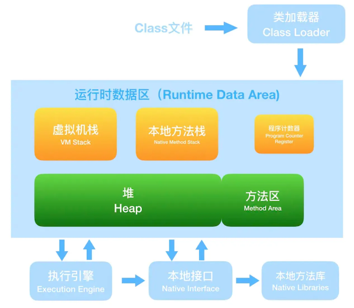
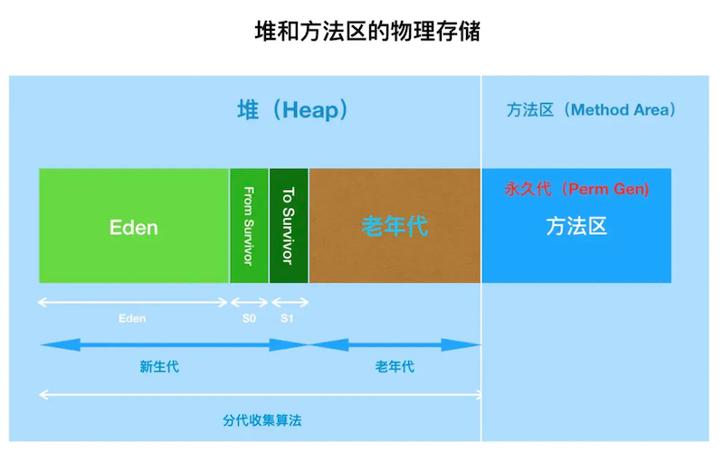
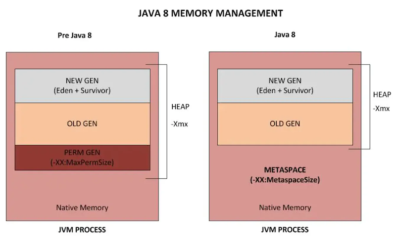

# JVM内存结构

java7及以前：

程序计数器：线程私有，指示当前线程执行字节码的位置。

虚拟机栈：线程私有，java方法执行的内存模型。

本地方法栈：线程私有，native方法执行的内存模型。

堆：共享区域，所有对象实例、数组都在堆上分配（已不绝对）。在实际内存分配时，为了提升分配效率，提前对Java堆划分为多个线程私有的分配缓冲区（TLAB）。

方法区：共享区域，存储已被虚拟机加载的类型信息、常量、静态变量、编译缓存等。

注意：对于字符串常量，jdk7之前，存放在永久代，jdk7及之后，存放在堆中。

堆和方法区在逻辑上是分开的，但在物理上，它们是连续的一块内存。也就是说，方法区和Eden、老年代是连续的。

Java7及以前版本的Hotspot中方法区位于永久代中。同时，永久代和堆是相互隔离的，但它们使用的物理内存是连续的。

对于习惯了在HotSpot虚拟机上开发、部署的程序员来说，很多都愿意将方法区称作永久代。

本质上来讲两者并不等价，仅因为Hotspot将GC分代扩展至方法区，或者说使用永久代来实现方法区。在其他虚拟机上是没有永久代的概念的。也就是说方法区是规范，永久代是Hotspot针对该规范进行的实现。

永久代的垃圾收集是和老年代捆绑在一起的，因此无论谁满了，都会触发永久代和老年代的垃圾收集。

Java8：

在Java8中，元空间(Metaspace)登上舞台，方法区存在于元空间(Metaspace)。同时，元空间不再与堆连续，而且是存在于本地内存（Native memory）。

本地内存（Native memory），也称为C-Heap，是供JVM自身进程使用的。当Java Heap空间不足时会触发GC，但Native memory空间不够却不会触发GC。

常用JVM参数：

-Xms：初始堆大小

-Xmx：最大堆大小

参考：[面试官，Java8中JVM内存结构变了，永久代到元空间](https://cloud.tencent.com/developer/article/1546965)
