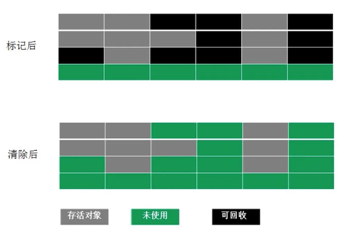
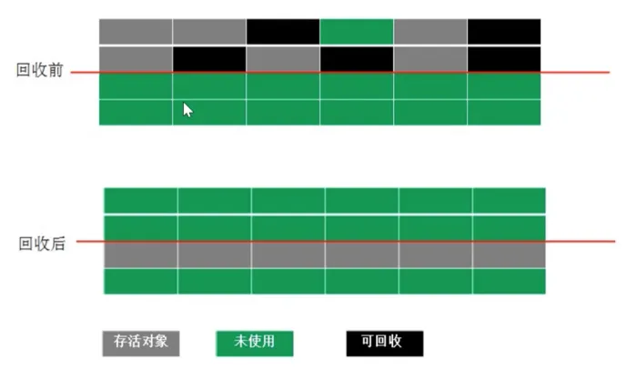
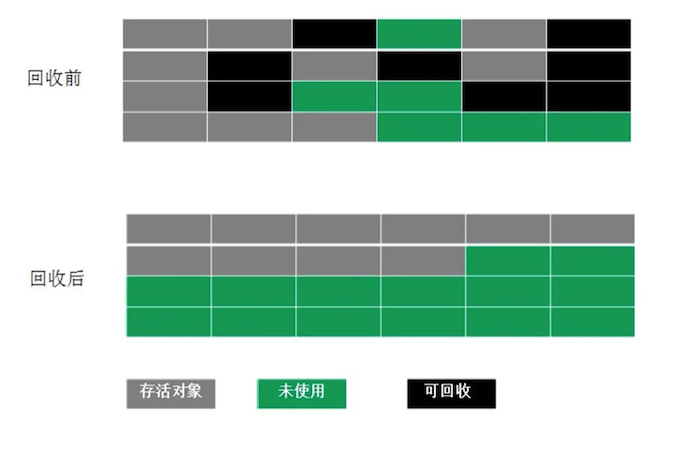

# 垃圾回收算法

MinorGC=YoungGC=新生代收集

MajorGC=OldGC=老年代收集（只有CMS单独收集老年代，MajorGC有时也指FullGC）

FullGC=堆区+方法区收集

## 标记-清除算法

特点：实现简单；效率不稳定；产生碎片。

## 标记-复制算法

特点：不会产生碎片；浪费空间。

## 标记-整理（压缩）算法

特点：没有碎片；效率偏低；StopTheWorld
