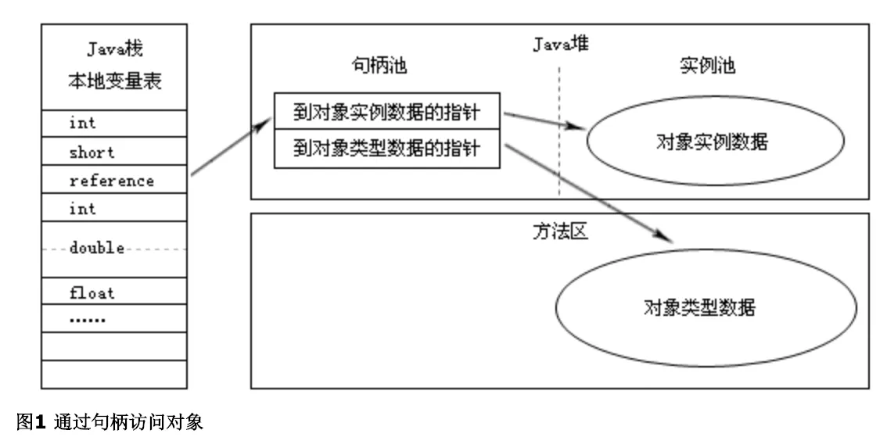

# 对象的访问定位

一共有两种方式：句柄，直接指针。

通过句柄访问对象：如果使用句柄访问的话，Java堆中将会划分出一块内存来作为句柄池，reference中存储的就是对象的句柄地址，而句柄中包含了对象实例数据与类型数据的具体各自的地址信息，如图1所示。

通过直接指针访问：如果使用直接指针访问的话，Java堆对象的布局中就必须考虑如何放置访问类型数据的相关信息，reference中存储的直接就是对象地址，如图2所示。

对比：

使用句柄更稳定，如果对象地址改变，则只需要修改句柄中的地址即可；使用直接指针速度更快，节省了一次指针定位时间。**HotSpot使用的是直接指针方式。**
