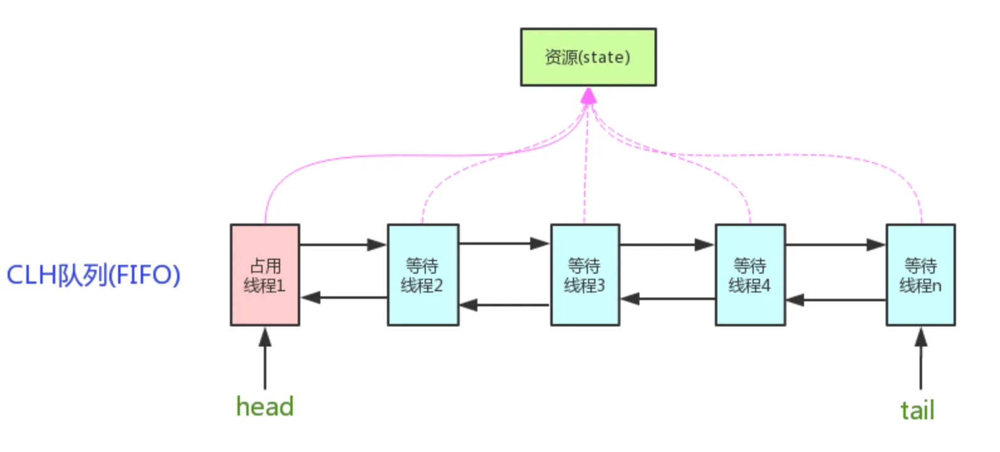

# AQS简介

AQS（Abstract Queued Synchronizer），即抽象队列同步器，是Java并发包 `java.util.concurrent` 的核心框架。AQS 是一个用来构建锁和同步器的框架，使用 AQS 能简单且高效地构造出应用广泛的同步器，比如 ReentrantLock、Semaphore、ReentrantReadWriteLock、SynchronousQueue、FutureTask 等等，都是基于 AQS 的。我们也可以利用 AQS 轻松定制专属的同步器，只要实现它的几个 protected 方法就可以了。

AQS核心思想是，如果被请求的共享资源空闲，则将当前请求资源的线程设置为有效的工作线程，并且将共享资源设置为锁定状态。如果被请求的共享资源被占用，那么就需要一套线程阻塞等待以及被唤醒时锁分配的机制，这个机制AQS是用CLH队列锁实现的，即将暂时获取不到锁的线程加入到队列中。

AQS定义的资源共享方式：

- Exclusive（独占）：只有一个线程能执行，如 ReentrantLock。又可分为公平锁和非公平锁：公平锁是按照线程在队列中的排队顺序，先到者先拿到锁；非公平锁是当线程要获取锁时，无视队列顺序直接去抢锁，谁抢到就是谁的；
- Share（共享）：多个线程可同时执行，如 Semaphore、CountDownLatch、CyclicBarrier；
- 组合式：ReentrantReadWriteLock 可以看成是组合式，因为 ReentrantReadWriteLock 也就是读写锁允许多个线程同时对某一资源进行读。

**参考：**

1. [到底什么是AQS（抽象队列同步器）？](https://javabetter.cn/thread/aqs.html)
2. [AQS 锁核心类详解](https://www.cnblogs.com/zhengzhaoxiang/p/13973928.html)
