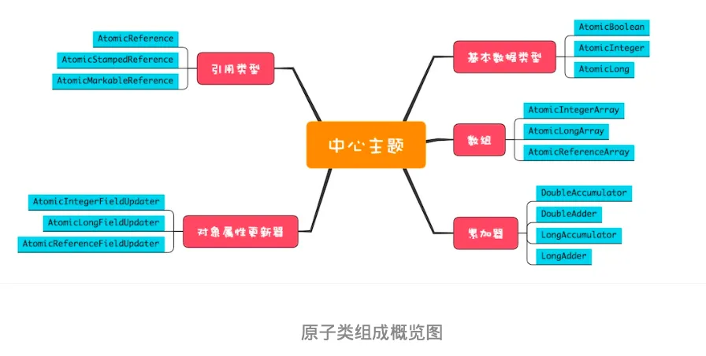

# Java原子类



## 基本数据类型

AtomicBoolean、AtomicInteger和AtomicLong

```java
//原子化i++
getAndIncrement()

//原子化的i--
getAndDecrement()

//原子化的++i
incrementAndGet()

//原子化的--i
decrementAndGet()

//当前值+=delta，返回+=前的值
getAndAdd(delta)

//当前值+=delta，返回+=后的值
addAndGet(delta)

//CAS操作，返回是否成功
compareAndSet(expect,update)

//以下四个方法,新值可以通过传入func函数来计算
getAndUpdate(func)
updateAndGet(func)
getAndAccumulate(x,func)
accumulateAndGet(x,func)
```

## 对象引用类型

AtomicReference、AtomicStampedReference 和 AtomicMarkableReference

AtomicStampedReference 和 AtomicMarkableReference 这两个原子类可以解决ABA问题（解决ABA问题的思路其实很简单，增加一个版本号维度就可以了）。

## 数组

AtomicIntegerArray、AtomicLongArray 和 AtomicReferenceArray

## 对象属性更新器

AtomicIntegerFieldUpdater、AtomicLongFieldUpdater 和 AtomicReferenceFieldUpdater，利用它们可以原子化地更新对象的属性，这三个方法都是利用反射机制实现的。需要注意的是，对象属性必须是 volatile 类型的，只有这样才能保证可见性。

## 累加器

DoubleAccumulator、DoubleAdder、LongAccumulator 和 LongAdder，这四个类仅仅用来执行累加操作，相比原子化的基本数据类型，速度更快。
