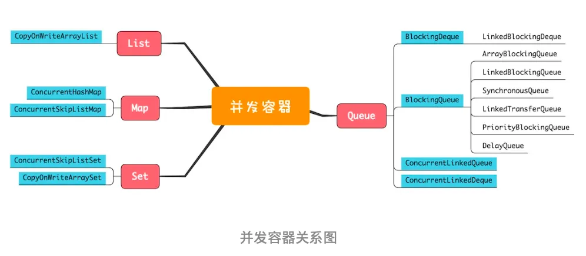
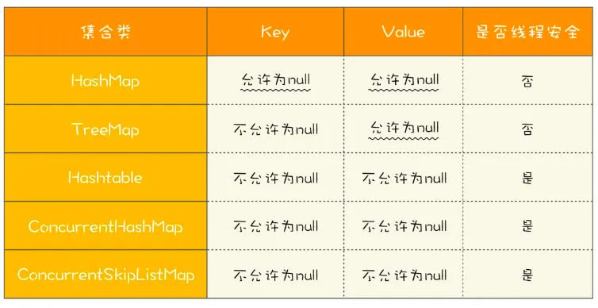

# Java并发容器类

## List

List里面只有一个实现类就是 CopyOnWriteArrayList。CopyOnWrite，顾名思义就是写的时候会将共享变量新复制一份出来，这样做的好处是读操作完全无锁。

CopyOnWriteArrayList 的问题：

1）仅适用于写操作非常少的场景，而且能够容忍短暂的读写不一致

2）迭代器是只读的

## Map

Map 接口的两个实现是 ConcurrentHashMap 和 ConcurrentSkipListMap，它们从应用的角度来看，主要区别在于 ConcurrentHashMap 的 key 是无序的，而 ConcurrentSkipListMap 的 key 是有序的。所以如果你需要保证 key 的顺序，就只能使用 ConcurrentSkipListMap。

ConcurrentSkipListMap 里面的 SkipList 本身就是一种数据结构，中文一般都翻译为跳表。跳表插入、删除、查询操作平均的时间复杂度是 O(logn)，理论上和并发线程数没有关系，所以在并发度非常高的情况下，若你对 ConcurrentHashMap 的性能还不满意，可以尝试一下 ConcurrentSkipListMap。

## Set

Set接口的两个实现是 CopyOnWriteArraySet 和 ConcurrentSkipListSet。CopyOnWriteArraySet 类似 CopyOnWriteArrayList，ConcurrentSkipListSet 类似 ConcurrentSkipListMap。

## Queue

Queue 可以从以下两个维度来分类：

1. 阻塞与非阻塞，所谓阻塞指的是当队列已满时，入队操作阻塞；当队列已空时，出队操作阻塞。
2. 单端与双端，单端指的是只能队尾入队，队首出队；而双端指的是队首队尾皆可入队出队。

Java 并发包里阻塞队列都用 Blocking 关键字标识，单端队列使用 Queue 标识，双端队列使用 Deque 标识。

**单端阻塞队列**

ArrayBlockingQueue：队列是数组实现

LinkedBlockingQueue：队列是链表实现

上述队列`offer()`和`poll()`方法不会阻塞；`put()`和`take()`方法会阻塞。

SynchronousQueue：不持有队列，此时生产者线程的入队操作必须等待消费者线程的出队操作

LinkedTransferQueue：融合 LinkedBlockingQueue 和 SynchronousQueue 的功能，性能比 LinkedBlockingQueue 更好

PriorityBlockingQueue：支持按照优先级出队

DelayQueue：支持延时出队

**双端阻塞队列**

LinkedBlockingDeque

**单端非阻塞队列**

ConcurrentLinkedQueue

**双端非阻塞队列**

ConcurrentLinkedDeque

上面我们提到的这些 Queue 中，只有 ArrayBlockingQueue 和 LinkedBlockingQueue 是支持有界的（所谓有界指的是内部的队列是否有容量限制），所以在使用其他无界队列时，一定要充分考虑是否存在导致 OOM 的隐患。
