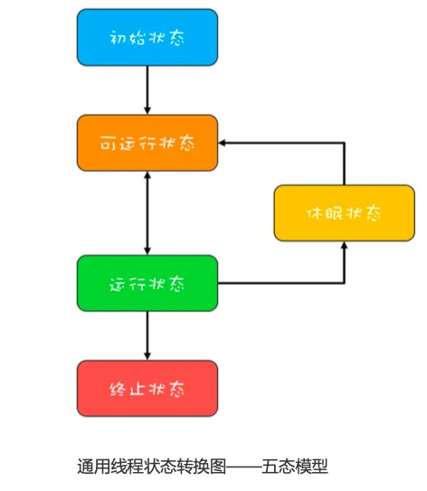
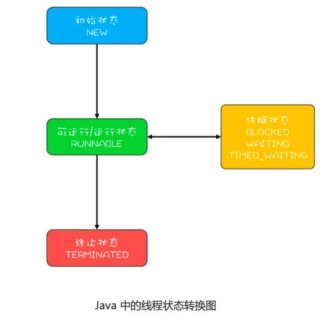
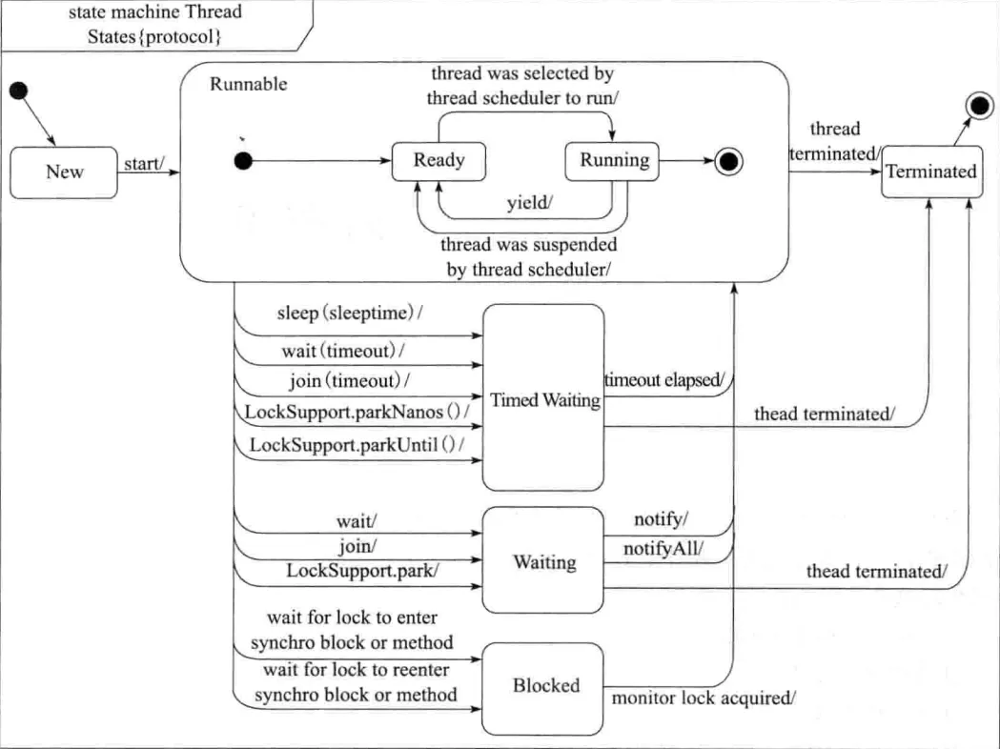

# Java线程生命周期

通用的线程生命周期（五态模型）：

Java线程的生命周期一共有六个阶段：

1. NEW(初始化状态)
2. RUNNABLE(可运行/运行状态)
3. BLOCKED(阻塞状态)
4. WAITING(无时限等待)
5. TIMED_WAITING(有时限等待)
6. TERMINATED(终止状态)

详细的Java线程状态转换：

**1. NEW到RUNNABLE状态**

Java刚创建出来的Thread对象就是NEW状态，而创建Thread对象主要有两种方法：一是继承Thread类，重写run()方法；二是实现Runnable接口，重写run()方法，并将该类对象作为创建Thread对象的参数。

**2. RUNNABLE与BLOCKED状态转换**

只有一种情况，就是线程等待锁时，由RUNNABLE转为BLOCKED状态，获得锁后，状态转回。

需要注意：当线程调用阻塞式API（如IO操作），此时Java状态仍然为RUNNABLE，但是在操作系统层面，线程状态会转到休眠状态。因为在JVM看来等待CPU和等待IO没有什么区别。

**3. RUNNABLE与WAITING状态转换**

有三种情况：

1）获得synchronized隐式锁的线程，调用无参数的Object.wait()方法。

2）调用无参数的Thread.join()方法。

其中的join()是一种线程同步方法，例如有一个线程对象threadA，当调用A.join()的时候，执行这条语句的线程会等待threadA执行完，而等待中的这个线程，其状态会从RUNNABLE转换到WAITING。

3）调用LockSupport.park()方法。

**4. RUNNABLE与TIMED_WAITING状态转换**

TIMED_WAITING和WAITING状态的区别，仅仅是触发条件多了超时参数。

有五种场景会触发这种转换:

1）调用带超时参数的Thread.sleep(longmillis)方法;

2）获得synchronized隐式锁的线程，调用带超时参数的Object.wait(longtimeout)方法;

3）调用带超时参数的Thread.join(longmillis)方法;

4）调用带超时参数的LockSupport.parkNanos(Objectblocker,longdeadline)方法;

5）调用带超时参数的LockSupport.parkUntil(longdeadline)方法。

**5. RUNNABLE到TERMINATED状态**

执行完，或抛出异常，则会自动进入TERMINATED状态。

如果要主动使某个线程进入TERMINATED，可以使用interrupt()方法。
