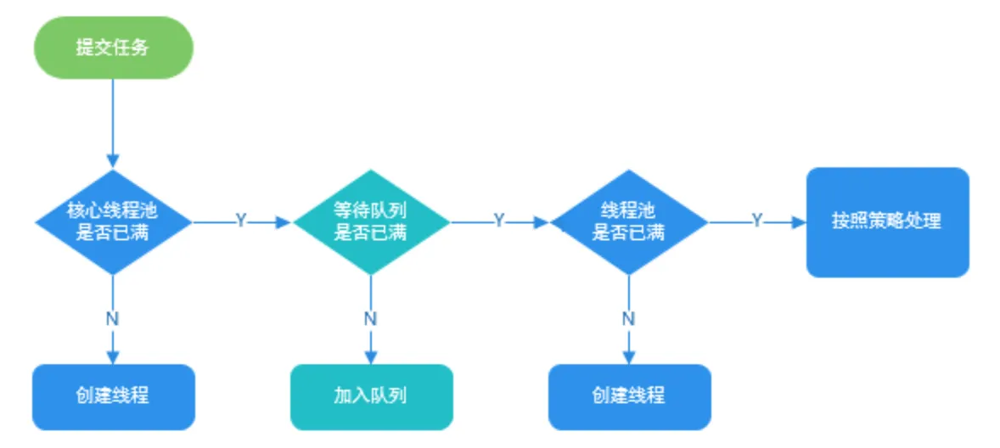

# 使用ThreadPoolExecutor创建线程池


ThreadPoolExecutor的参数：

```java
    public ThreadPoolExecutor(int corePoolSize,
                              int maximumPoolSize,
                              long keepAliveTime,
                              TimeUnit unit,
                              BlockingQueue<Runnable> workQueue,
                              ThreadFactory threadFactory,
                              RejectedExecutionHandler handler) {
        if (corePoolSize < 0 ||
            maximumPoolSize <= 0 ||
            maximumPoolSize < corePoolSize ||
            keepAliveTime < 0)
            throw new IllegalArgumentException();
        if (workQueue == null || threadFactory == null || handler == null)
            throw new NullPointerException();
        this.corePoolSize = corePoolSize;
        this.maximumPoolSize = maximumPoolSize;
        this.workQueue = workQueue;
        this.keepAliveTime = unit.toNanos(keepAliveTime);
        this.threadFactory = threadFactory;
        this.handler = handler;
    }
```

提交任务时，线程池任务调度逻辑（coresize->等待队列->maxsize->拒绝策略）：



1. 如果当前线程数小于coresize，则直接分配线程执行
2. 如果当前线程数大于coresize，则尝试提交到等待队列
3. 如果等待队列未满，则等待执行
4. 如果等待队列已满，则查看当前线程数是否大于maxsize
5. 如果小于maxsize，则分配线程执行
6. 如果大于maxsize，则执行拒绝策略

ThreadPoolExecutor 的参数：

- （核心）corePoolSize：核心线程数
- （核心）maximumPoolSize：最大线程数
- （核心）workQueue:：等待队列
- keepAliveTime：空闲时，多余线程销毁时间。当线程池中的线程数量大于corePoolSize的时候，如果这时没有新的任务提交，核心线程外的线程不会立即销毁，而是会等待，直到等待的时间超过了keepAliveTime才会被回收销毁；
- unit：keepAliveTime参数的时间单位；
- threadFactory：线程工厂
- handler：拒绝策略

```
阻塞队列：
ArrayBlockingQueue：先进先出，数组实现的阻塞队列，必须指定容量。可以指定公平性，默认非公平。
LinkedBlockingQueue：先进先出，链表实现的阻塞队列，可以指定容量，如果不指定，默认为Integer.MAX_VALUE。
PriorityBlockingQueue：按优先级出队。
DelayQueue：延迟队列。
SynchronousQueue：无容量的队列
注：一般使用LinkedBlockingQueue，因为链表节省空间，而且进出各一个锁，效率较一个锁的ArrayBlockingQueue高，但是务必指定容量。

*BlockingQueue阻塞队列添加元素的方法一共有三个，主要区别在于如果超过长度限制时的处理方式：
add：超过长度直接抛异常
offer：超过长度返回false
put：会阻塞一段时间，然后等待队列有空间时再添加元素

拒绝策略：
AbortPolicy（默认）：抛出异常，停止工作。
CallerRunsPolicy：让调用线程来执行。
DiscardOldestPolicy：丢弃当前**即将执行**的任务（即最老的那个任务），尝试提交当前任务。
DiscardPolicy：直接丢弃，不作任何处理。
```

举个例子：

线程池类：

```java
import java.util.concurrent.ArrayBlockingQueue;
import java.util.concurrent.ThreadPoolExecutor;
import java.util.concurrent.TimeUnit;

public class ThreadPoolExecutorDemo {

    private static final int CORE_POOL_SIZE = 5;
    private static final int MAX_POOL_SIZE = 10;
    private static final int QUEUE_CAPACITY = 100;
    private static final Long KEEP_ALIVE_TIME = 1L;
    public static void main(String[] args) {

        //使用阿里巴巴推荐的创建线程池的方式
        //通过ThreadPoolExecutor构造函数自定义参数创建
        ThreadPoolExecutor executor = new ThreadPoolExecutor(
                CORE_POOL_SIZE,
                MAX_POOL_SIZE,
                KEEP_ALIVE_TIME,
                TimeUnit.SECONDS,
                new ArrayBlockingQueue<>(QUEUE_CAPACITY),
                new UserThreadFactory("justTest"),
                new ThreadPoolExecutor.CallerRunsPolicy());

        for (int i = 0; i < 10; i++) {
            //创建WorkerThread对象（WorkerThread类实现了Runnable 接口）
            Runnable worker = new MyRunnable("" + i);
            //执行Runnable
            executor.execute(worker);
        }
        //终止线程池
        executor.shutdown();
        while (!executor.isTerminated()) {
        }
        System.out.println("Finished all threads");
    }
}
```

线程工厂类：

```java
import java.util.concurrent.ThreadFactory;
import java.util.concurrent.atomic.AtomicInteger;

public class UserThreadFactory implements ThreadFactory {
    private final String namePrefix;
    private final AtomicInteger nextId = new AtomicInteger(1);

    // 定义线程组名称，在 jstack 问题排查时，非常有帮助
    UserThreadFactory(String whatFeaturOfGroup) {
        namePrefix = "From UserThreadFactory's " + whatFeaturOfGroup + "-Worker-";
    }

    @Override
    public Thread newThread(Runnable task) {
        String name = namePrefix + nextId.getAndIncrement();
        Thread thread = new Thread(null, task, name, 0);
        System.out.println(thread.getName());
        return thread;
    }
}
```

任务类：

```java
import java.util.Date;

/**
 * 这是一个简单的Runnable类，需要大约5秒钟来执行其任务。
 * @author shuang.kou
 */
public class MyRunnable implements Runnable {

    private String command;

    public MyRunnable(String s) {
        this.command = s;
    }

    @Override
    public void run() {
        System.out.println(Thread.currentThread().getName() + " Start. Time = " + new Date());
        processCommand();
        System.out.println(Thread.currentThread().getName() + " End. Time = " + new Date());
    }

    private void processCommand() {
        try {
            System.out.println(Thread.currentThread().getName() + "执行命令");
            Thread.sleep(5000);
        } catch (InterruptedException e) {
            e.printStackTrace();
        }
    }

    @Override
    public String toString() {
        return this.command;
    }
}
```

执行结果：

```
/Library/Java/JavaVirtualMachines/jdk1.8.0_202.jdk/Contents/Home/bin/java "-javaagent:/Applications/IntelliJ IDEA.app/Contents/lib/idea_rt.jar=51023:/Applications/IntelliJ IDEA.app/Contents/bin" -Dfile.encoding=UTF-8 -classpath /Library/Java/JavaVirtualMachines/jdk1.8.0_202.jdk/Contents/Home/jre/lib/charsets.jar:/Library/Java/JavaVirtualMachines/jdk1.8.0_202.jdk/Contents/Home/jre/lib/deploy.jar:/Library/Java/JavaVirtualMachines/jdk1.8.0_202.jdk/Contents/Home/jre/lib/ext/cldrdata.jar:/Library/Java/JavaVirtualMachines/jdk1.8.0_202.jdk/Contents/Home/jre/lib/ext/dnsns.jar:/Library/Java/JavaVirtualMachines/jdk1.8.0_202.jdk/Contents/Home/jre/lib/ext/jaccess.jar:/Library/Java/JavaVirtualMachines/jdk1.8.0_202.jdk/Contents/Home/jre/lib/ext/jfxrt.jar:/Library/Java/JavaVirtualMachines/jdk1.8.0_202.jdk/Contents/Home/jre/lib/ext/localedata.jar:/Library/Java/JavaVirtualMachines/jdk1.8.0_202.jdk/Contents/Home/jre/lib/ext/nashorn.jar:/Library/Java/JavaVirtualMachines/jdk1.8.0_202.jdk/Contents/Home/jre/lib/ext/sunec.jar:/Library/Java/JavaVirtualMachines/jdk1.8.0_202.jdk/Contents/Home/jre/lib/ext/sunjce_provider.jar:/Library/Java/JavaVirtualMachines/jdk1.8.0_202.jdk/Contents/Home/jre/lib/ext/sunpkcs11.jar:/Library/Java/JavaVirtualMachines/jdk1.8.0_202.jdk/Contents/Home/jre/lib/ext/zipfs.jar:/Library/Java/JavaVirtualMachines/jdk1.8.0_202.jdk/Contents/Home/jre/lib/javaws.jar:/Library/Java/JavaVirtualMachines/jdk1.8.0_202.jdk/Contents/Home/jre/lib/jce.jar:/Library/Java/JavaVirtualMachines/jdk1.8.0_202.jdk/Contents/Home/jre/lib/jfr.jar:/Library/Java/JavaVirtualMachines/jdk1.8.0_202.jdk/Contents/Home/jre/lib/jfxswt.jar:/Library/Java/JavaVirtualMachines/jdk1.8.0_202.jdk/Contents/Home/jre/lib/jsse.jar:/Library/Java/JavaVirtualMachines/jdk1.8.0_202.jdk/Contents/Home/jre/lib/management-agent.jar:/Library/Java/JavaVirtualMachines/jdk1.8.0_202.jdk/Contents/Home/jre/lib/plugin.jar:/Library/Java/JavaVirtualMachines/jdk1.8.0_202.jdk/Contents/Home/jre/lib/resources.jar:/Library/Java/JavaVirtualMachines/jdk1.8.0_202.jdk/Contents/Home/jre/lib/rt.jar:/Library/Java/JavaVirtualMachines/jdk1.8.0_202.jdk/Contents/Home/lib/ant-javafx.jar:/Library/Java/JavaVirtualMachines/jdk1.8.0_202.jdk/Contents/Home/lib/dt.jar:/Library/Java/JavaVirtualMachines/jdk1.8.0_202.jdk/Contents/Home/lib/javafx-mx.jar:/Library/Java/JavaVirtualMachines/jdk1.8.0_202.jdk/Contents/Home/lib/jconsole.jar:/Library/Java/JavaVirtualMachines/jdk1.8.0_202.jdk/Contents/Home/lib/packager.jar:/Library/Java/JavaVirtualMachines/jdk1.8.0_202.jdk/Contents/Home/lib/sa-jdi.jar:/Library/Java/JavaVirtualMachines/jdk1.8.0_202.jdk/Contents/Home/lib/tools.jar:/Users/givedrug/IdeaProjects/Hello/target/classes ExecutorDemo.ThreadPoolExecutorDemo
From UserThreadFactory's justTest-Worker-1
From UserThreadFactory's justTest-Worker-2
From UserThreadFactory's justTest-Worker-3
From UserThreadFactory's justTest-Worker-4
From UserThreadFactory's justTest-Worker-5
From UserThreadFactory's justTest-Worker-4 Start. Time = Tue Jun 23 20:52:55 CST 2020
From UserThreadFactory's justTest-Worker-4执行命令
From UserThreadFactory's justTest-Worker-1 Start. Time = Tue Jun 23 20:52:55 CST 2020
From UserThreadFactory's justTest-Worker-1执行命令
From UserThreadFactory's justTest-Worker-5 Start. Time = Tue Jun 23 20:52:55 CST 2020
From UserThreadFactory's justTest-Worker-5执行命令
From UserThreadFactory's justTest-Worker-2 Start. Time = Tue Jun 23 20:52:55 CST 2020
From UserThreadFactory's justTest-Worker-2执行命令
From UserThreadFactory's justTest-Worker-3 Start. Time = Tue Jun 23 20:52:55 CST 2020
From UserThreadFactory's justTest-Worker-3执行命令
From UserThreadFactory's justTest-Worker-4 End. Time = Tue Jun 23 20:53:01 CST 2020
From UserThreadFactory's justTest-Worker-4 Start. Time = Tue Jun 23 20:53:01 CST 2020
From UserThreadFactory's justTest-Worker-4执行命令
From UserThreadFactory's justTest-Worker-1 End. Time = Tue Jun 23 20:53:01 CST 2020
From UserThreadFactory's justTest-Worker-1 Start. Time = Tue Jun 23 20:53:01 CST 2020
From UserThreadFactory's justTest-Worker-1执行命令
From UserThreadFactory's justTest-Worker-5 End. Time = Tue Jun 23 20:53:01 CST 2020
From UserThreadFactory's justTest-Worker-5 Start. Time = Tue Jun 23 20:53:01 CST 2020
From UserThreadFactory's justTest-Worker-5执行命令
From UserThreadFactory's justTest-Worker-2 End. Time = Tue Jun 23 20:53:01 CST 2020
From UserThreadFactory's justTest-Worker-2 Start. Time = Tue Jun 23 20:53:01 CST 2020
From UserThreadFactory's justTest-Worker-2执行命令
From UserThreadFactory's justTest-Worker-3 End. Time = Tue Jun 23 20:53:01 CST 2020
From UserThreadFactory's justTest-Worker-3 Start. Time = Tue Jun 23 20:53:01 CST 2020
From UserThreadFactory's justTest-Worker-3执行命令
From UserThreadFactory's justTest-Worker-4 End. Time = Tue Jun 23 20:53:06 CST 2020
From UserThreadFactory's justTest-Worker-2 End. Time = Tue Jun 23 20:53:06 CST 2020
From UserThreadFactory's justTest-Worker-3 End. Time = Tue Jun 23 20:53:06 CST 2020
From UserThreadFactory's justTest-Worker-1 End. Time = Tue Jun 23 20:53:06 CST 2020
From UserThreadFactory's justTest-Worker-5 End. Time = Tue Jun 23 20:53:06 CST 2020
Finished all threads

Process finished with exit code 0
```

总结： 

1、用 ThreadPoolExecutor 自定义线程池，看线程是的用途，如果任务量不大，可以用无界队列，如果任务量非常大，要用有界队列，防止 OOM。

2、如果任务量很大，还要求每个任务都处理成功，要对提交的任务进行阻塞提交（ put 到 BlockingQueue ），重写拒绝机制，改为阻塞提交。保证不抛弃一个任务。

3、最大线程数一般设为 2N+1 最好，N 是 CPU 核数（也要综合考虑机器参数、部署情况、是否 CPU 密集型、任务类型）。

4、核心线程数，看应用，如果是任务，一天跑一次，设置为 0，合适，因为跑完就停掉了，如果是常用线程池，看任务量，是保留一个核心还是几个核心线程数。

5、如果要获取任务执行结果，用 CompletionService，但是注意，获取任务的结果的要重新开一个线程获取，如果在主线程获取，就要等任务都提交后才获取，就会阻塞大量任务结果，队列过大 OOM，所以最好异步开个线程获取结果。
