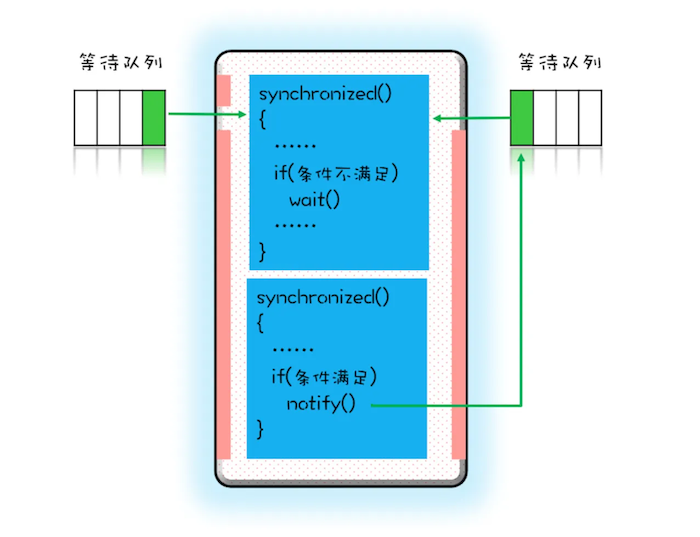
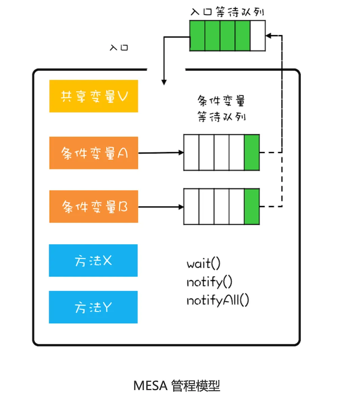
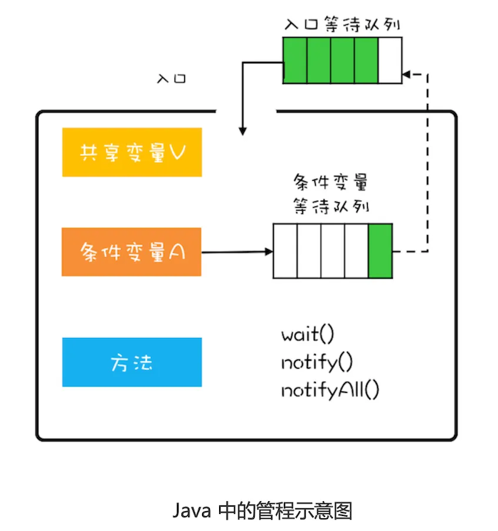

# 管程模型与等待-通知机制


## 等待-通知机制

线程首先获取互斥锁，当线程要求的条件不满足时，释放互斥锁，进入等待状态；当要求的条件满足时，通知等待的线程，重新获取互斥锁。

使用 synchronized 配合 wait()、notify()、notifyAll() 这三个方法就可以实现等待-通知机制。notify() 是会随机地通知等待队列中的一个线程，而 notifyAll() 会通知等待队列中的所有线程（除非经过深思熟虑，否则尽量使用 notifyAll() ）。



```java
public class Allocator {
    private List<Object> als;

    //申请资源（一次性申请所有资源）
    synchronized void apply(Object from, Object to) {
        //有可能唤醒后条件再次不满足，所以需要while循环
        while (als.contains(from) || als.contains(to)) {
            try {
                wait();
            } catch (Exception e) {
                //do sth.
            }
        }
        als.add(from);
        als.add(to);
    }

    //归还资源
    synchronized void free(Object from, Object to) {
        als.remove(from);
        als.remove(to);
        notifyAll();
    }
}
```

## 管程

所谓管程（Monitor，有翻译为监视器），指的是管理共享变量以及对共享变量的操作过程，让它们支持并发。

并发编程里两大核心问题——互斥和同步，都可以由管程来帮你解决。

管程是一个抽象概念，synchronized 就是 java 针对管程的一种实现。

在管程的发展史上，先后出现过三种不同的管程模型，分别是：Hasen 模型、Hoare 模型和 MESA 模型。Java 参考的是 MESA 模型来实现管程。



Java内置的管程方案（synchronized）使用简单，synchronized 关键字修饰的代码块，在编译期会自动生成相关加锁和解锁的代码，但是仅支持一个条件变量：



MESA中 wait() 的编程范式，是在一个 while 循环中调用 wait()。

```java
while(条件不满足){
	wait();
}
```

除非经过深思熟虑，否则尽量使用 notifyAll()。

如果要使用 notify() 则需要满足下面的条件：

1. 所有等待线程拥有相同的等待条件;
2. 所有等待线程被唤醒后，执行相同的操作;
3. 只需要唤醒一个线程。

```java
static class BlockingQ {
        private static final int MAX_SIZE = 10;
        private final List<String> queue = new ArrayList<>(MAX_SIZE);

        public void put(String s) throws InterruptedException {
            synchronized (queue) {
                while (queue.size() >= MAX_SIZE)
                    queue.wait();
                queue.add(s);
                queue.notifyAll();
            }
        }

        public String get() throws InterruptedException {
            synchronized (queue) {
                while (queue.isEmpty()) {
                    queue.wait();
                }
                String result = queue.remove(0);
                queue.notifyAll();
                return result;
            }
        }
    }
```
