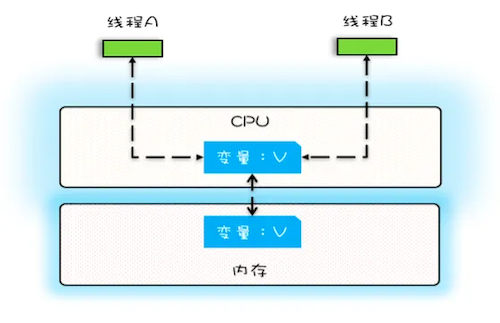
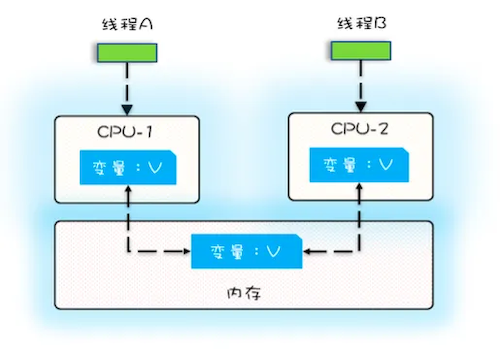

# 线程安全问题的根源：可见性、原子性、有序性

**缓存**导致了可见性问题，**线程切换**带来了原子性问题，**编译优化**带来了有序性问题

## 可见性

一个线程对共享变量的修改，另外一个线程能够立刻看到，我们称为**可见性**。

单核CPU不存在可见性问题：

多核CPU可能存在可见性问题：

线程A和线程B同时拿到了变量V的缓存，但其中一个线程对V的修改，不会马上让另一个线程知晓，从而后写入内存的会覆盖先写入的值。

## 原子性

我们把一个或者多个操作在 CPU 执行的过程中不被中断的特性称为**原子性**。

在32位系统中，long类型变量的赋值操作不具有原子性，一个long变量占64位，如果在更改变量值时，刚更改完前32位，就被别的线程抢占，那么此时后32位还没来得及更改，造成赋值错误。

## 有序性

编译器为了优化性能，可能会调整语句的先后顺序，从而造成**有序性**问题。
