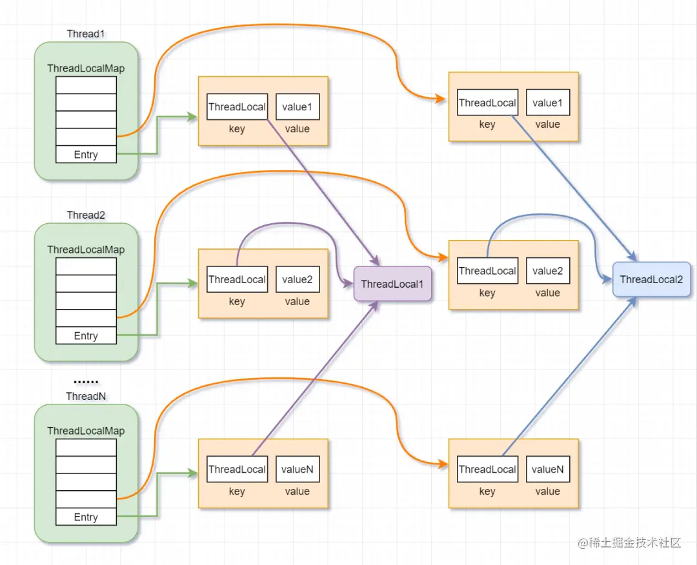

# 线程封闭与ThreadLocal类

局部变量存储在各自线程的独立栈空间中，不与其他线程共享，所以不存在安全性问题，这称为线程封闭。

数据库连接池里获取的连接Connection，就采用线程封闭技术，在Connection释放前，不会分配给其他线程，从而保证了安全性。

## Ad-hoc线程封闭

就是通过编码保证线程封闭，这就会有风险。

## 栈封闭

栈封闭简单理解就是通过局部变量来实现线程封闭，多个线程访问对象的同一个方法，方法内部的局部变量会拷贝到每个线程的线程栈当中，只有当前线程才能访问到，互不干扰。所以局部变量是不被多个线程所共享的。

## ThreadLocal类

维护线程封闭一种更规范的方法就是使用ThreadLocal。ThreadLocal提供get和set方法，这些方法为每个使用该变量的线程都存有一份独立的副本因此get总是返回的是当前线程在调用set时设置的值。

