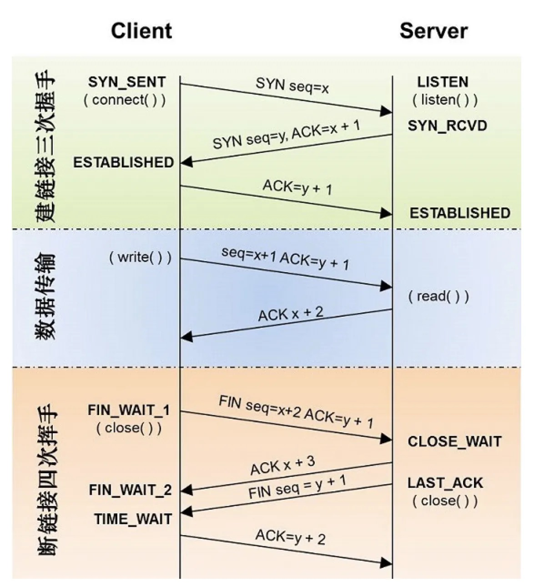

# TCP三次握手，四次挥手

**三次握手：**

第一次握手：建立连接。客户端发送连接请求报文段，将SYN位置为1，Sequence Number为x；然后，客户端进入SYN_SEND状态，等待服务器的确认；

第二次握手：服务器收到SYN报文段。服务器收到客户端的SYN报文段，需要对这个SYN报文段进行确认，设置Acknowledgment Number为x+1(Sequence Number+1)；同时，自己自己还要发送SYN请求信息，将SYN位置为1，Sequence Number为y；服务器端将上述所有信息放到一个报文段（即SYN+ACK报文段）中，一并发送给客户端，此时服务器进入SYN_RECV状态；

第三次握手：客户端收到服务器的SYN+ACK报文段。然后将Acknowledgment Number设置为y+1，向服务器发送ACK报文段，这个报文段发送完毕以后，客户端和服务器端都进入ESTABLISHED状态，完成TCP三次握手。 完成了三次握手，客户端和服务器端就可以开始传送数据。以上就是TCP三次握手的总体介绍。

**为什么要三次握手？**

在谢希仁著《计算机网络》第四版中讲“三次握手”的目的是“为了防止已失效的连接请求报文段突然又传送到了服务端，因而产生错误”。在另一部经典的《计算机网络》一书中讲“三次握手”的目的是为了解决“网络中存在延迟的重复分组”的问题。

两者表达了同一件事：假设客户端发送了一个SYN请求建立连接（第一次握手），但这个SYN报文因为网络拥堵延迟了很久才到达服务器。客户端等待超时后，认为连接失败，于是重新发送了一个新的SYN（新的第一次握手）并成功建立了连接、传输数据、关闭了连接。这时，那个延迟了很久的旧 SYN 终于到达了服务器。如果只有两次握手，服务器收到旧SYN，会认为是一个新的连接请求，于是分配资源准备通信，但这个连接是无效的，这就造成了资源浪费。

另一方面，三次握手最主要的目的就是双方确认自己与对方的发送与接收是正常的。

第一次握手：Client什么都不能确认；Server确认了对方发送正常，自己接收正常

第二次握手：Client确认了：自己发送、接收正常，对方发送、接收正常；Server确认了：对方发送正常，自己接收正常

第三次握手：Client确认了：自己发送、接收正常，对方发送、接收正常；Server确认了：自己发送、接收正常，对方发送、接收正常

三次握手就能确认双方收发功能都正常，缺一不可。

**四次分手：**

第一次分手：主机1（可以使客户端，也可以是服务器端），设置Sequence Number和Acknowledgment Number，向主机2发送一个FIN报文段；此时，主机1进入FIN_WAIT_1状态；这表示主机1没有数据要发送给主机2了；

第二次分手：主机2收到了主机1发送的FIN报文段，向主机1回一个ACK报文段，Acknowledgment Number为Sequence Number加1；主机1进入FIN_WAIT_2状态；主机2告诉主机1，我“同意”你的关闭请求；

第三次分手：主机2向主机1发送FIN报文段，请求关闭连接，同时主机2进入LAST_ACK状态；

第四次分手：主机1收到主机2发送的FIN报文段，向主机2发送ACK报文段，然后主机1进入TIME_WAIT状态；主机2收到主机1的ACK报文段以后，就关闭连接；此时，主机1等待2MSL后依然没有收到回复，则证明Server端已正常关闭，那好，主机1也可以关闭连接了。

**为什么要四次分手？**

那四次分手又是为何呢？TCP协议是一种面向连接的、可靠的、基于字节流的运输层通信协议。TCP是全双工模式，这就意味着，当主机1发出FIN报文段时，只是表示主机1已经没有数据要发送了，主机1告诉主机2，它的数据已经全部发送完毕了；但是，这个时候主机1还是可以接受来自主机2的数据；当主机2返回ACK报文段时，表示它已经知道主机1没有数据发送了，但是主机2还是可以发送数据到主机1的；当主机2也发送了FIN报文段时，这个时候就表示主机2也没有数据要发送了，就会告诉主机1，我也没有数据要发送了，之后彼此就会愉快的中断这次TCP连接。如果要正确的理解四次分手的原理，就需要了解四次分手过程中的状态变化。

举个例子：A和B打电话，通话即将结束后。

第一次挥手：A说“我没啥要说的了”

第二次挥手：B回答“我知道了”，但是B可能还会有要说的话，A不能要求B跟着自己的节奏结束通话

第三次挥手：于是B可能又巴拉巴拉说了一通，最后B说“我说完了”

第四次挥手：A回答“知道了”，这样通话才算结束。

（转载自：[TCP协议的“三次握手”和“四次挥手”](https://www.cnblogs.com/zhaoyunxiang/p/15012561.html)）（参考JavaGuide修改）
