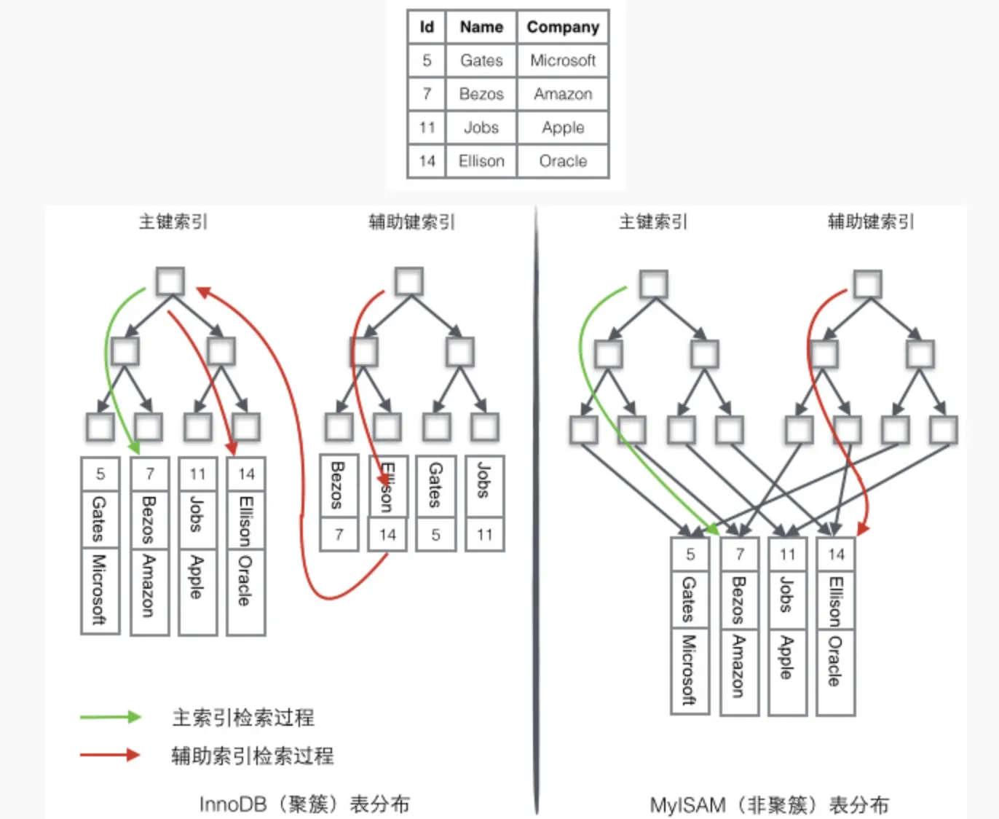

# InnoDB聚簇索引和MyISAM非聚簇索引

在《数据库原理》一书中是这么解释聚簇索引和非聚簇索引的区别的：

聚簇索引的叶子节点就是数据节点，而非聚簇索引的叶子节点仍然是索引节点，只不过有指向对应数据块的指针。叶子节点用双向链表连接。

聚簇索引的优点：

1. 当你需要取出一定范围内的数据时，用聚簇索引也比用非聚簇索引好。
2. 当通过聚簇索引查找目标数据时理论上比非聚簇索引要快，因为非聚簇索引定位到对应主键时还要多一次目标记录寻址,即多一次I/O。
3. 使用覆盖索引扫描的查询可以直接使用页节点中的主键值。

聚簇索引的缺点：

1. 插入速度严重依赖于插入顺序，按照主键的顺序插入是最快的方式，否则将会出现页分裂，严重影响性能。因此，对于InnoDB表，我们一般都会定义一个自增的ID列为主键。
2. 更新主键的代价很高，因为将会导致被更新的行移动。因此，对于InnoDB表，我们一般定义主键为不可更新。
3. 二级索引访问需要两次索引查找，第一次找到主键值，第二次根据主键值找到行数据。二级索引的叶节点存储的是主键值，而不是行指针（非聚簇索引存储的是指针或者说是地址），这是为了减少当出现行移动或数据页分裂时二级索引的维护工作，但会让二级索引占用更多的空间。
4. 采用聚簇索引插入新值比采用非聚簇索引插入新值的速度要慢很多，因为插入要保证主键不能重复，判断主键不能重复，采用的方式在不同的索引下面会有很大的性能差距，聚簇索引遍历所有的叶子节点，非聚簇索引也判断所有的叶子节点，但是聚簇索引的叶子节点除了带有主键还有记录值，记录的大小往往比主键要大的多。这样就会导致聚簇索引在判定新记录携带的主键是否重复时进行昂贵的I/O代价。
