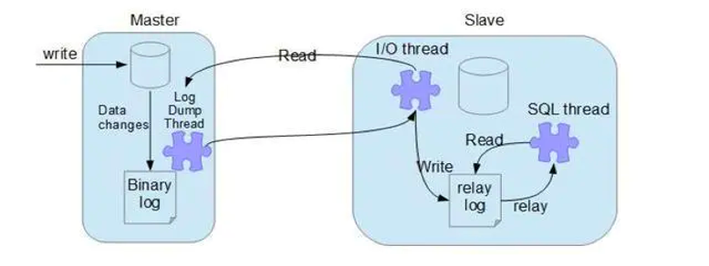
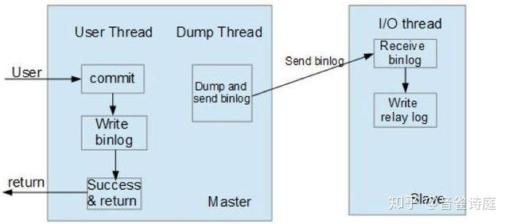
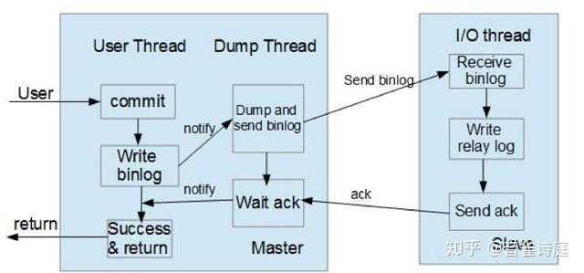

# MySQL主从复制

## 主从复制

MySQL 主从复制涉及到三个线程，一个运行在主节点（log dump thread），其余两个(I/O thread, SQL thread)运行在从节点。

- **Log Dump Thread**：当从节点连接主节点时，主节点会创建一个 log dump 线程，用于发送 bin-log 的内容。在读取 bin-log 中的操作时，此线程会对主节点上的 bin-log 加锁，当读取完成，甚至在发动给从节点之前，锁会被释放。
- **I/O Thread**：当从节点上执行  start slave 命令之后，从节点会创建一个 I/O 线程用来连接主节点，请求主库中更新的 bin-log。I/O线程接收到主节点 binlog dump 进程发来的更新之后，保存在本地 relay-log 中。
- **SQL Thread**：负责读取 relay log 中的内容，解析成具体的操作并执行，最终保证主从数据的一致性。

一个 slave 节点可同时从多个 master 进行数据复制，在这种情况下，不同 master 的 bin-log 存储在不同的 relay log中。

## 同步模式

**异步模式（mysql async-mode）**

MySQL增删改操作会全部记录在 binary log 中，当 slave 节点连接 master 时，会主动从 master 处获取最新的 bin log 文件。

**半同步模式(mysql semi-sync)**

这种模式下主节点只需要接收到其中一台从节点的返回信息，就会  commit；否则需要等待直到超时时间然后切换成异步模式再提交；这样做的目的可以使主从数据库的数据延迟缩小，可以提高数据安全性，确保了事务提交后，binlog 至少传输到了一个从节点上，不能保证从节点将此事务更新到 db 中。性能上会有一定的降低，响应时间会变长。

**全同步模式**

是指主节点和从节点全部执行了 commit 并确认才会向客户端返回成功。

## 主从复制的延迟问题

进行主从同步的过程中，如果使用异步或半异步模式，均会有主从节点数据不一致的窗口时间。同时，从节点上的  SQL Thread 只能串行执行 relay-log 中的记录，当某条 DDL/DML 耗时较长时，会加剧这个窗口时间；再者在某些场景下会使用 slave 节点进行数据读取，这也可能导致数据加锁等待。基于以上原因在处理主从复制延迟问题上有以下几种方向：

1. 优化主从节点之间的网络延迟
2. 降低 master 负载，以减少 TPS
3. 降低 slave 负载，slave 只做备份使用，不提供服务
4. 调整 slave 参数：关闭 slave bin-log 等
5. 多线程的主从复制：不同 schema 下的表并发提交时的数据不会相互影响，即 slave 节点可以用对 relay log 中不同的 schema 各分配一个 SQL Thread，来重放 relay log 中主库已经提交的事务

**参考：**

1. [快速搭建MySQL主从系统](https://cloud.tencent.com/developer/article/1955482)
2. [MySQL 主从复制模式](https://www.cnblogs.com/haihefeng/articles/17602976.html)
