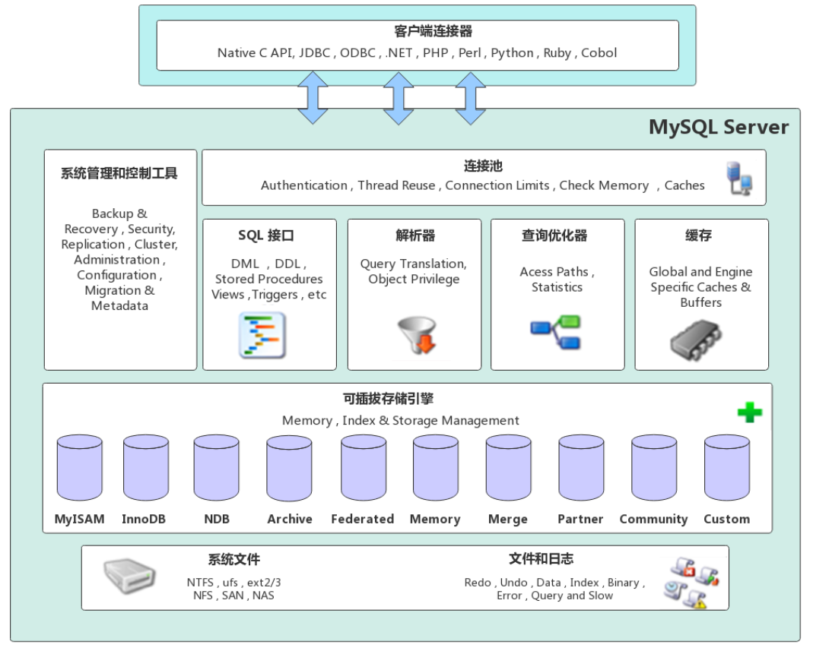

# MySQL体系架构

从MySQL的架构图，我们可以看出MySQL的架构自顶向下大致可以分为网络连接层、数据库服务层、存储引擎层和系统文件层四大部分。接下来，我们就来简单说说每个部分的组成信息。

## 网络连接层

网络连接层位于整个MySQL体系架构的最上层，主要担任客户端连接器的角色。提供与MySQL服务器建立连接的能力，几乎支持所有主流的服务端语言，例如：Java、C、C++、Python等，各语言都是通过各自的API接口与MySQL建立连接。

## 数据库服务层

数据库服务层是整个数据库服务器的核心，主要包括了系统管理和控制工具、连接池、SQL接口、解析器、查询优化器和缓存等部分。

连接池：主要负责存储和管理客户端与数据库的连接信息，连接池里的一个线程负责管理一个客户端到数据库的连接信息。

系统管理和控制工具：提供数据库系统的管理和控制功能，例如对数据库中的数据进行备份和恢复，保证整个数据库的安全性，提供安全管理，对整个数据库的集群进行协调和管理等。

SQL接口：主要负责接收客户端发送过来的各种SQL命令，并将SQL命令发送到其他部分，并接收其他部分返回的结果数据，将结果数据返回给客户端。

解析树：主要负责对请求的SQL解析成一棵“解析树”，然后根据MySQL中的一些规则对“解析树”做进一步的语法验证，确认其是否合法。

查询优化器：在MySQL中，如果“解析树”通过了解析器的语法检查，此时就会由优化器将其转化为执行计划，然后与存储引擎进行交互，通过存储引擎与底层的数据文件进行交互。

缓存：MySQL的缓存是由一系列的小缓存组成的。例如：MySQL的表缓存，记录缓存，MySQL中的权限缓存，引擎缓存等。MySQL中的缓存能够提高数据的查询性能，如果查询的结果能够命中缓存，则MySQL会直接返回缓存中的结果信息。

## 存储引擎层

MySQL中的存储引擎层主要负责数据的写入和读取，与底层的文件进行交互。值得一提的是，MySQL中的存储引擎是插件式的，服务器中的查询执行引擎通过相关的接口与存储引擎进行通信，同时，接口屏蔽了不同存储引擎之间的差异。MySQL中，最常用的存储引擎就是InnoDB和MyISAM。

## 系统文件层

系统文件层主要包括MySQL中存储数据的底层文件，与上层的存储引擎进行交互，是文件的物理存储层。其存储的文件主要有：日志文件、数据文件、配置文件、MySQL的进行pid文件和socket文件等。

- MySQL中的日志主要包括：错误日志、通用查询日志、二进制日志、慢查询日志等。
- 数据文件中主要包括了：db.opt文件、frm文件、MYD文件、MYI文件、ibd文件、ibdata文件、ibdata1文件、ib_logfile0和ib_logfile1文件等。
- 配置文件用于存储MySQL所有的配置信息，在Unix/Linux环境中是my,cnf文件，在Windows环境中是my.ini文件。
- pid文件是存放MySQL进程运行时的进程号的文件，主要存在于Unix/Linux环境中，具体的存储目录可以在my.cnf或者my.ini文件中进行配置。
- socket文件和pid文件一样，都是MySQL在Unix/Linux环境中运行才会有的文件。在Unix/Linux环境中，客户端可以直接通过socket来连接MySQL。

（转载自：[一文搞懂MySQL体系架构！！](https://www.cnblogs.com/binghe001/p/14654973.html)）
