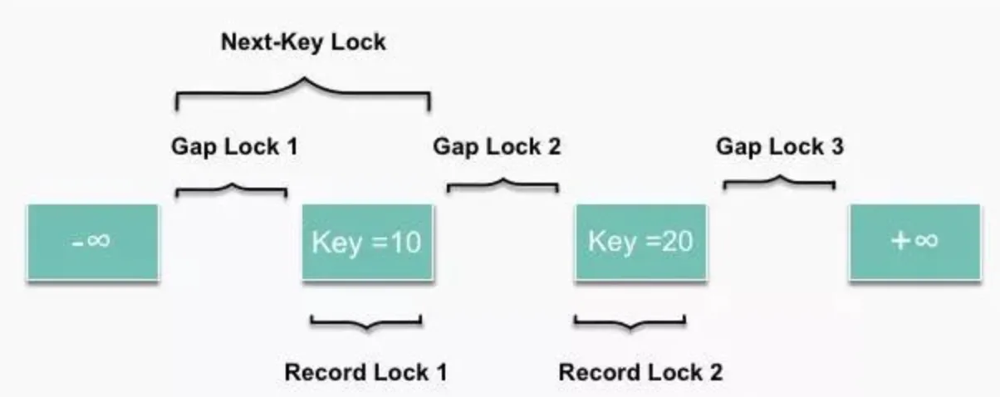

# MySQL的行锁


**表级锁**：开销小，加锁快；不会出现死锁；锁定粒度大，发生锁冲突的概率最高，并发度最低（MyISAM 和 MEMORY 存储引擎采用的是表级锁）；

**行级锁**：开销大，加锁慢；会出现死锁；锁定粒度最小，发生锁冲突的概率最低，并发度也最高（InnoDB 存储引擎既支持行级锁也支持表级锁，在索引检索时，采用行锁，否则表锁）；

**页面锁**：开销和加锁时间界于表锁和行锁之间；会出现死锁；锁定粒度界于表锁和行锁之间，并发度一般。

|        | 行锁  | 表锁  | 页锁  |
| ------ | --- | --- | --- |
| MyISAM |     | Yes |     |
| InnoDB | Yes | Yes |     |
| Memory |     | Yes |     |

行锁的三种算法：



Record Lock记录锁：单行记录上的锁。select或update时，必须是主键或唯一索引列且是精确匹配=，否则退化为临键锁。

Gap Lock间隙锁：锁定一个范围，不包括记录本身。解决可重复读级别下的幻读问题（非唯一索引）。

Next-Key Lock临键锁（记录锁+间隙锁）：锁定一个范围，包括记录本身。

默认隔离级别REPEATABLE-READ下，InnoDB中行锁**默认使用算法Next-KeyLock**，只有当查询的索引是**唯一索引或主键**时，InnoDB会对Next-KeyLock进行优化，将其降级为RecordLock，即仅锁住索引本身，而不是范围。当查询的索引为辅助索引时，InnoDB则会使用Next-KeyLock进行加锁。InnoDB对于辅助索引有特殊的处理，不仅会锁住辅助索引值所在的范围，还会将其下一键值加上GapLOCK。

```
例子：
对于非唯一索引b，有值1，1，3，6，8
对于 where b = 3，先加 Next-Key 锁(1,3]，再加 Gap 锁(3,6)综合来看就是锁了(1,6)
```

参考：[MySQL 探秘（七）：InnoDB 行锁算法](https://toutiao.io/posts/q34ohu/preview)
