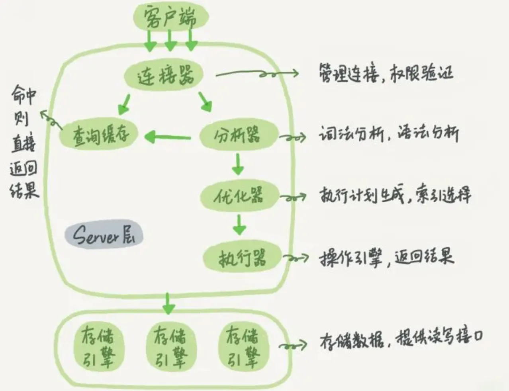

# 一条SQL语句在MySQL的执行流程

执行步骤为：

1. 客户端请求
2. 连接器（验证用户身份，给予权限）
3. 查询缓存（存在缓存则直接返回，不存在则执行后续操作）
4. 分析器（对SQL进行词法分析和语法分析操作）
5. 优化器（主要对执行的sql优化选择最优的执行方案方法）
6. 执行器（执行时会先看用户是否有执行权限，有才去使用这个引擎提供的接口）
7. 去引擎层获取数据返回（如果开启查询缓存则会缓存查询结果）

参考：https://blog.csdn.net/m0_52973251/article/details/129028829
