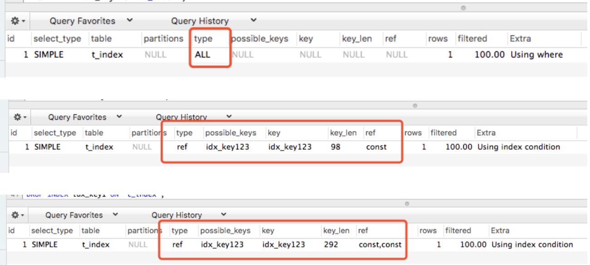

# 索引失效总结


## 一、准备工作

创建一张表 `t_index` ，脚本如下：

```sql
CREATE TABLE `t_index` (
  `id` bigint(20) unsigned NOT NULL AUTO_INCREMENT COMMENT '表记录标识号，数据库主键，不用于实际业务',
  `key1` varchar(32) COLLATE utf8_bin NOT NULL DEFAULT '' COMMENT '字段1',
  `key2` varchar(64) COLLATE utf8_bin NOT NULL DEFAULT '' COMMENT '字段2',
  `key3` varchar(64) COLLATE utf8_bin NOT NULL DEFAULT '' COMMENT '字段3',
  `del_flag` tinyint(3) unsigned NOT NULL DEFAULT '0' COMMENT '删除标志。0未删除，1删除。',
  `create_time` timestamp NOT NULL DEFAULT CURRENT_TIMESTAMP COMMENT '记录创建时间',
  `update_time` timestamp NOT NULL DEFAULT CURRENT_TIMESTAMP ON UPDATE CURRENT_TIMESTAMP COMMENT '记录修改时间',
  PRIMARY KEY (`id`),
  KEY `idx_create_time` (`create_time`),
  KEY `idx_update_time` (`update_time`)
) ENGINE=InnoDB DEFAULT CHARSET=utf8 COLLATE=utf8_bin COMMENT='索引表';
```

## 二、普通索引

### 1. 创建索引

在字段 `key1` 上创建索引，脚本如下：

```sql
ALTER TABLE `t_index` ADD INDEX idx_key1(key1);
```

### 2. 走索引情况

```sql
-- 查询语句
SELECT * FROM `t_index` WHERE key1 = '1';

-- 执行计划
EXPLAIN SELECT * FROM `t_index` WHERE key1 = '1';
```

结果显示走索引查询：


### 3. 不走索引情况

#### （1）查询条件使用不等式

```sql
SELECT * FROM `t_index` WHERE key1 <> '1';
```

查看执行计划，结果显示全表扫描：


总结：不等式 `<>` 或 `!=` 会导致索引失效。

#### （2）查询条件类型不一致

```sql
SELECT * FROM `t_index` WHERE key1 = 1;
```

查看执行计划，结果显示全表扫描：


总结：字段 `key1` 为字符串，传入的值为数字类型，会导致索引失效。

#### （3）查询条件使用函数计算

```sql
SELECT * FROM `t_index` WHERE key1 + 1 = 1;
SELECT * FROM `t_index` WHERE CHAR_LENGTH(key1) = 1;
```

查看执行计划，结果显示全表扫描：


总结：函数计算 `x+1` 、 `x-1` 、`CHAR_LENGTH(x)` 等会导致索引失效。

#### （4）模糊查询

```sql
SELECT * FROM `t_index` WHERE key1 LIKE  '3';
SELECT * FROM `t_index` WHERE key1 LIKE  '%3';
SELECT * FROM `t_index` WHERE key1 LIKE  '3%';
```

查看执行计划：


总结：模糊查询查询条件前缀模糊不会走索引。

## 三、复合索引

### 1. 创建索引

删除刚才的索引，在字段 `key1, key2, key3` 上创建复合索引，脚本如下：

```sql
DROP INDEX idx_key1 ON `t_index`;
ALTER TABLE `t_index` ADD INDEX idx_key123(key1, key2, key3);
```

### 2. 走索引情况

```sql
-- 查询语句
SELECT * FROM `t_index` WHERE key1 = '1' AND key2 = '2' AND key3 = '3';

-- 执行计划
EXPLAIN SELECT * FROM `t_index` WHERE key1 = '1' AND key2 = '2' AND key3 = '3';
```

结果显示走索引查询：


### 3. 不走索引情况

#### （1）查询条件使用不等式

```sql
SELECT * FROM `t_index` WHERE key1 <> '1' AND key2 = '2' AND key3 = '3';
SELECT * FROM `t_index` WHERE key1 = '1' AND key2 <> '2' AND key3 = '3';
SELECT * FROM `t_index` WHERE key1 = '1' AND key2 = '2' AND key3 <> '3';
```

查看执行计划，结果显示全表扫描，三种情况结果一样：


总结：只要有一个条件含有不等式，都不会走索引。

#### （2）查询条件类型不一致

```sql
SELECT * FROM `t_index` WHERE key1 = 1 AND key2 = '2' AND key3 = '3';
SELECT * FROM `t_index` WHERE key1 = '1' AND key2 = 2 AND key3 = '3';
SELECT * FROM `t_index` WHERE key1 = '1' AND key2 = '2' AND key3 = 3;
```

查看执行计划，结果显示（第一个参数类型不一致走全表扫描，第二个参数类型不一致，索引仅仅能使用第一列，第三个参数类型不一致，索引能使用前两列）：


总结：从第一个查询条件开始，第N个参数类型不一致，索引能使用前N-1列。

#### （3）查询条件使用函数计算

```sql
SELECT * FROM `t_index` WHERE key1 + 1 = '1' AND key2 = '2' AND key3 = '3';
SELECT * FROM `t_index` WHERE key1 = '1' AND key2 + 1 = '2' AND key3 = '3';
SELECT * FROM `t_index` WHERE key1 = '1' AND key2 = '2' AND key3 + 1 = '3';
```

查看执行计划，结果同上（第一个参数类型不一致走全表扫描，第二个参数类型不一致，索引仅仅能使用第一列，第三个参数类型不一致，索引能使用前两列）：



总结：从第一个查询条件开始，第N个参数使用函数，索引能使用前N-1列。

#### （4）不使用索引首列当查询条件

```sql
SELECT * FROM `t_index` WHERE key2 = '2' AND key3 = '3';
SELECT * FROM `t_index` WHERE key2 = '2';
SELECT * FROM `t_index` WHERE key3 = '3';
```

查看执行计划，结果显示（都不会走索引），三种情况结果一样：


总结：查询条件不使用复合索引的首列，均会导致索引失效。

（转载自：[MySQL索引失效总结](https://juejin.cn/post/6844903954392825869)）
