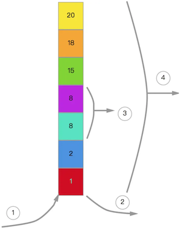
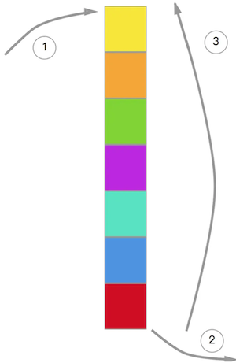
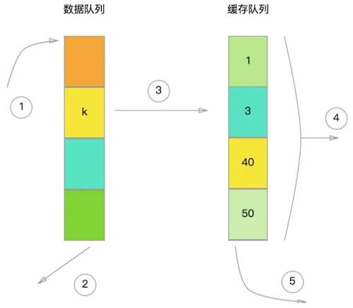

# Redis删除策略与淘汰机制


## 删除策略

1、定时删除

对于每一个设置了过期时间的key都会创建一个定时器，一旦到达过期时间就立即删除。该策略可以立即清除过期的数据，对内存较友好，但是缺点是占用了大量的CPU资源去处理过期的数据，会影响Redis的吞吐量和响应时间。

2、惰性删除

当访问一个key时，才判断该key是否过期，过期则删除。该策略能最大限度地节省CPU资源，但是对内存却十分不友好。有一种极端的情况是可能出现大量的过期key没有被再次访问，因此不会被清除，导致占用了大量的内存。

3、定期删除

每隔一段时间，扫描Redis中过期key字典，并清除部分过期的key。该策略是前两者的一个折中方案，还可以通过调整定时扫描的时间间隔和每次扫描的限定耗时，在不同情况下使得CPU和内存资源达到最优的平衡效果。

## 淘汰机制

Redis 内存淘汰算法会在以下情况下被触发：

- 内存使用超过预设限制：当 Redis 实例的内存使用超过了配置文件中设置的 maxmemory 预设值时，Redis 会根据配置文件中的 maxmemory-policy 来选择一个合适的内存淘汰算法。这是为了确保 Redis 不会耗尽系统内存，从而导致性能下降或系统崩溃。
- 达到内存警戒线：当 Redis 实例的内存使用接近预设限制时，Redis 可能会提前启动内存淘汰策略。这是因为 Redis 需要保留一定的内存空间来处理新的写入请求，例如 SET、HSET、LPUSH 等。为了确保写入请求的顺利进行，提前启动内存淘汰策略是有必要的。
- 手动触发：在某些情况下，管理员可能会手动触发内存淘汰策略，例如执行内存清理操作或者在 Redis 实例的内存使用快速增长时。这可以通过使用 redis-cli 工具或编程接口（例如 Python、Node.js 等）发送 MEMORY PURGE 命令来实现。

常见的淘汰算法有：

Random：随机选择淘汰

LFU（Least Frequently Used）：删除最不经常使用



```
LFU算法：
1：新数据进入队列 （新数据块的引用计数为1），每次加入新数据时，整个队列就会重新排列；
2：不需要的数据淘汰；
3：引用计数如果相同时，根据时间先后顺序进行排列；
4：整体是根据引用计数进行排列，引用计数越大越在上面，引用1次，引用计数加1；
这种方式：需要维护队列中所有数据的访问记录，每个数据块都要维护对应的引用计数。
由此联想，所有数据块的访问记录都需要维护，用引用计数去进行队列元素排序，内存消耗很高。
```

LRU（Least Recently Used）：删除最近最少使用（可以理解为是LRU-1）



```
LRU算法：
1：加入新的数据
2：队列空间满了的时候，尾部的数据会被淘汰掉
3：如果要访问队列中的数据，该数据会被移动到队列的头部
频繁地访问，会造成数据被访问到的几率会下降，此外，这种normal模式也叫做LRU-1，即最近使用过1次。
```

LRU-K（Least Recently Used-K）：是 LRU 算法的扩展，考虑了缓存项最近的 K 次访问时间。



```
LRU-K算法：
1：新数据加入
2：淘汰数据（这个地方和LRU尾部淘汰是一个道理）
3：某个数据块被访问次数达到k次，每次都会重新排列缓存队列
4：根据时间进行排列
5：插入第k访问时，淘汰距离这次插入时间最久的数据，即淘汰缓存队列中时间最久的数据块
LRU-K：记录被访问过的数据，记录他们的访问次数，缓存列表基于时间排列，基于时间淘汰数据块；
内存消耗会比LRU-1更大
```

**参考：**

1. [理解Redis的内存回收机制](https://www.cnblogs.com/capacity-yang/p/13095005.html)
2. [Redis 内存淘汰算法什么时候会被触发](https://blog.csdn.net/HongZeng_CSDN/article/details/130112050)
3. [LFU、LRU、LRU K](https://juejin.cn/post/6844903523445014536)
