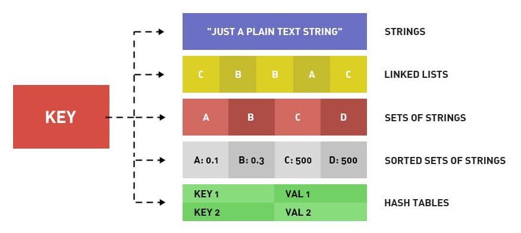

# Redis数据类型

首先对redis来说，所有的key（键）都是字符串。我们在谈基础数据结构时，讨论的是存储值的数据类型，常见的有五种：String（字符串），Hash（哈希），List（列表），Set（集合）、Zset（有序集合）。 

随着 Redis 版本的更新，后面又支持了四种数据类型： BitMap（2.2 版新增）、HyperLogLog（2.8 版新增）、GEO（3.2 版新增）、Stream（5.0 版新增）。

Redis 内部使用一个 redisObject 对象来表示所有的 key 和 value 。redisObject 中 type 表示一个 value 对象具体是何种数据类型，encoding 是不同数据类型在 Redis 内部的存储方式。

比如：type = string 表示 value 存储的是一个普通字符串，那么 encoding 可以是 raw 或者 int。

| 类型                | 简介                                       | 特性                                       | 场景                      |
| ----------------- | ---------------------------------------- | ---------------------------------------- | ----------------------- |
| string (字符串)      | 二进制安全                                    | 可以包含任何数据，比如 jpg 图片或序列化对象                 | —                       |
| Hash (字典)         | 键值对集合，即编程语言中的 map 类型                     | 适合存储对象，并且可以像数据库中的 update 一个属性一样只修改某一项属性值 | 存储、读取、修改用户属性            |
| List (列表)         | 链表（双向链表）                                 | 增删快，提供了操作某一元素的 API                       | 最新消息队列；消息队列             |
| set (集合)          | hash 表实现，元素不重复                           | 添加、删除、查找的复杂度都是 O(1)，并提供了交集、并集、差集的操作      | 共同好友；利用唯一性，统计访问网站的所有 IP |
| sorted set (有序集合) | 在 set 的基础上增加了一个权重参数 score，元素按 score 有序排列 | 数据插入集合时天然有序，可用作带权重的消息队列                  | 排行榜；带权重的消息队列            |

（1）String 是 Redis 最基本的类型，可以理解成与 Memcached 一模一样的类型，一个 Key 对应一个 Value。Value 不仅是 String，也可以是数字。

String 类型是二进制安全的，意思是 Redis 的 String 类型可以包含任何数据，比如 jpg 图片或者序列化的对象。String 类型的值最大能存储 512M。

（2）Hash 是一个键值（key-value）的集合。Redis 的 Hash 是一个 String 的 Key 和 Value 的映射表，Hash 特别适合存储对象。常用命令：hget，hset，hgetall等。

（3）List 列表是简单的字符串列表，按照插入顺序排序。可以添加一个元素到列表的头部（左边）或者尾部（右边）常用命令：lpush、rpush、lpop、rpop、lrange（获取列表片段）等。

应用场景：List 应用场景非常多，也是 Redis 最重要的数据结构之一，比如 Twitter 的关注列表，粉丝列表都可以用 List 结构来实现。也可以用来当消息队列。

实现方式：Redis List 的是实现是一个双向链表，既可以支持反向查找和遍历，更方便操作，不过带来了额外的内存开销。Redis 提供了 List 的 Push 和 Pop 操作，还提供了操作某一段的 API，可以直接查询或者删除某一段的元素。

（4）Set 是 String 类型的无序集合。集合是通过 hashtable 实现的。Set 中的元素是没有顺序的，而且是没有重复的。常用命令：sdd、spop、smembers、sunion等。

应用场景：Redis Set 对外提供的功能和 List 一样是一个列表，特殊之处在于 Set 是自动去重的，而且 Set 提供了判断某个成员是否在一个 Set 集合中。

（5）Zset 和 Set 一样是 String 类型元素的集合，且不允许重复的元素。常用命令：zadd、zrange、zrem、zcard等。

使用场景：SortedSet 可以通过用户额外提供一个优先级（score）的参数来为成员排序，并且是插入有序的，即自动排序。当你需要一个有序的并且不重复的集合列表，那么可以选择 SortedSet 结构。

实现方式：和 Set 相比，SortedSet 关联了一个 Double 类型权重的参数 Score，使得集合中的元素能够按照 Score 进行有序排列，Redis 正是通过分数来为集合中的成员进行从小到大的排序。Redis SortedSet 的内部使用 HashMap 和跳跃表（skipList）来保证数据的存储和有序，HashMap 里放的是成员到 Score 的映射。而跳跃表里存放的是所有的成员，排序依据是 HashMap 里存的 Score，使用跳跃表的结构可以获得比较高的查找效率，并且在实现上比较简单。

**参考：**

1. [Redis入门 - 数据类型：5种基础数据类型详解](https://pdai.tech/md/db/nosql-redis/db-redis-data-types.html)
2. [Redis 几种数据类型及应用场景](https://juejin.cn/post/6844903951502934030)
