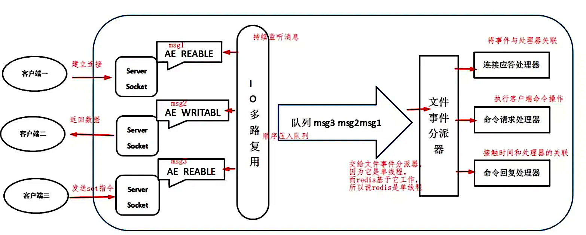

# Redis线程模型

Redis基于Reactor模式开发了网络事件处理器，这个处理器被称为文件事件处理器。它的组成结构为4部分：多个套接字、IO多路复用程序、文件事件分派器、事件处理器。因为文件事件分派器队列的消费是单线程的，所以Redis才叫单线程模型。

**为啥 Redis 单线程模型也能效率这么高？**

- 纯内存操作
- 核心是基于非阻塞的 IO 多路复用机制
- 单线程反而避免了多线程的频繁上下文切换问题

Redis 的单线程架构在保证高性能和数据一致性的同时，在 Redis 6 及以后的版本中通过引入多线程优化（如网络 I/O 多线程和模块多线程）进一步提升了其在现代应用中的适应性和扩展性。
