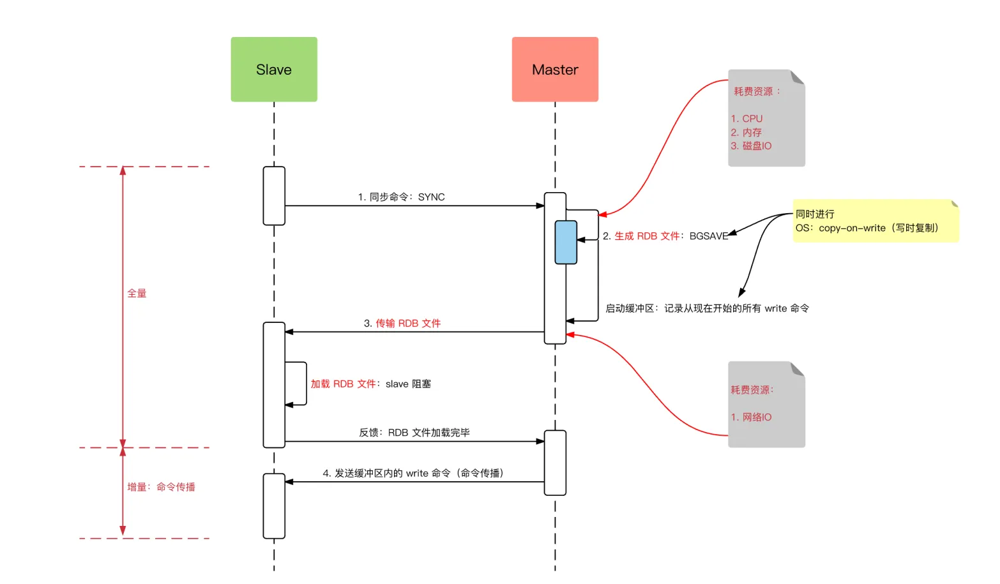
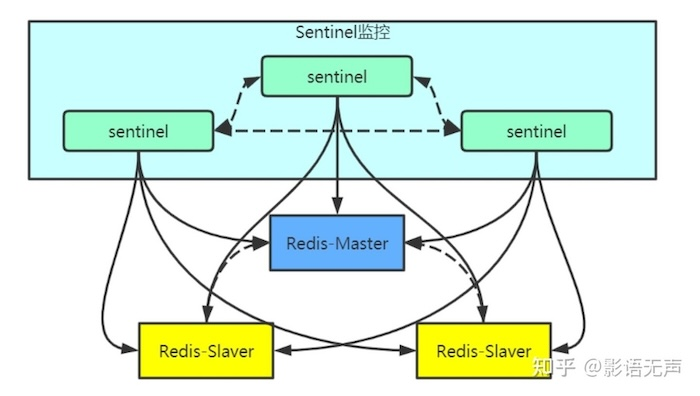
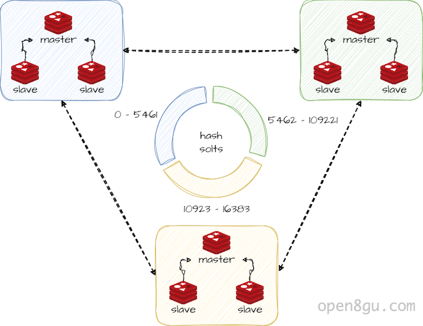

# 四种Redis部署模式

## 单机模式

最基本的部署方式，仅包含一个 Redis 实例。简单易部署，适用于小规模应用、开发阶段或对高可用性要求不高的场景。不具备高可用性和数据冗余，单点故障风险高。

## 主从复制模式

主从复制模式中，数据库分为两类，一类是主数据库（master），另一类是从数据库(slave）。主数据库可以进行读写操作，当写操作导致数据变化时会自动将数据同步给从数据库。而从数据库一般是只读的，并接受主数据库同步过来的数据。一个主数据库可以拥有多个从数据库，而一个从数据库只能拥有一个主数据库。

缺点是，当主服务器宕机后，需要手动把一台从服务器切换为主服务器。

（1）主从关系建立后，从节点向主节点发送一个 SYNC 命令请求进行主从同步。

（2）主节点收到 SYNC 命令后，执行 fork 创建一个子进程，子进程中将所有的数据按特定编码存储到 RDB（Redis Database） 文件中，这就产生了数据库的快照。

（3）主节点将此快照发送给从节点，从节点接收并载入快照。主节点接着将生成快照、发送快照期间积压的写命令发送给从节点，从节点接收这些命令并执行，命令执行后，从节点中的数据也就有了同样的变更。

（4）此后，主节点源源不断地新执行的写命令同步到从节点，从节点执行传播来的命令。如此，主从数据保持一致。需要说明的是，命令传播存在时延的，所以任意时刻，不能保证主从节点间数据完全一致。

## 哨兵模式

哨兵（sentinel）是 Redis 的高可用性(High Availability)的解决方案：由一个或多个 sentinel 实例组成 sentinel 集群可以监视一个或多个主服务器和多个从服务器。

每个哨兵定时向其他服务器以及其他哨兵发送请求。假设主服务器宕机，哨兵1先检测到这个结果，系统并不会马上进行 failover 过程，仅仅是哨兵1主观的认为主服务器不可用，这个现象成为**主观下线**。当后面的哨兵也检测到主服务器不可用，并且数量达到一定值时，那么哨兵之间就会进行一次投票，投票的结果由一个哨兵发起，进行 failover 操作。切换成功后，就会通过发布订阅模式，让各个哨兵把自己监控的从服务器实现切换主机，这个过程称为**客观下线**。这样对于客户端而言，一切都是透明的。

## 集群模式

和 MySQL 等传统数据库的分库分表一样，Redis 集群同样基于分片算法实现。在 Redis 集群中，共划分了 16384 （即 2 ^ 14）个哈希槽，集群中的每个节点都拥有其中的一部分槽位，当客户端发起请求时，可以直接请求集群中的任意节点，节点将会通过哈希函数确认 Key 落在哪一个槽位上，进而确认客户端的请求最终需要路由到集群中的哪一个节点。

其中，每个 Redis 实例都可以拥有多个从节点（不过从节点一般只作为备份，并不提供服务），并且不同的 Redis 实例之间会通过 Gossip 协议保持通信，它们将会分享彼此的哈希槽分配情况，并在主节点宕机时连接到新的备用节点。

如果需要扩容，这时需要重新分配哈希槽，因此涉及到原有主节点向新节点复制部分数据的操作。

**参考：**

1. [一文读懂Redis的四种模式，单机、主从、哨兵、集群 ](https://www.cnblogs.com/zhonglongbo/p/13128955.html)
2. [Redis 主从复制的原理及演进](https://juejin.cn/post/7070458131431555108)
3. [Redis哨兵机制原理](https://zhuanlan.zhihu.com/p/607354346)
4. [什么是Redis-Cluster集群？](https://open8gu.com/redis/high-availability/ivylinovg8bmar5x/)
