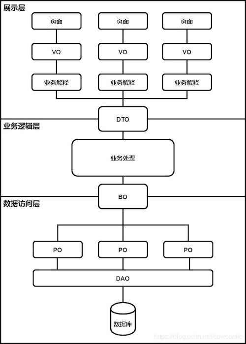

# 代码分层设计


## 总体分层设计

阿里巴巴《Java开发手册》推荐的应用分层设计为：


**开放API层**：可直接封装Service接口暴露成RPC接口；通过Web封装成http接口；网关控制层等。

**终端显示层**：各个端的模板渲染并执行显示的层。当前主要是velocity渲染，JS渲染，JSP渲染，移动端展示等。

**Web层**：主要是对访问控制进行转发，各类基本参数校验，或者不复用的业务简单处理等。

**Service层**：相对具体的业务逻辑服务层。

**Manager层**：通用业务处理层，它有如下特征：
- 1）对第三方平台封装的层，预处理返回结果及转化异常信息，适配上层接口。
- 2）对Service层通用能力的下沉，如缓存方案、中间件通用处理。
- 3）与DAO层交互，对多个DAO的组合复用。

**DAO层**：数据访问层，与底层MySQL、Oracle、Hbase、OceanBase等进行数据交互。

**第三方服务**：包括其它部门RPC服务接口，基础平台，其它公司的HTTP接口，如淘宝开放平台、支付宝付款服务、高德地图服务等。

**外部数据接口**：外部（应用）数据存储服务提供的接口，多见于数据迁移场景中。

## 分层异常处理

**DAO层**：产生的异常类型有很多，无法用细粒度的异常进行catch，使用catch(Exceptione)方式，并thrownewDAOException(e)，不需要打印日志，因为日志在Manager或Service层一定需要捕获并打印到日志文件中去，如果同台服务器再打日志，浪费性能和存储。

**Service层**：出现异常时，必须记录出错日志到磁盘，尽可能带上参数和上下文信息，相当于保护案发现场。

**Manager层**：如果与Service同机部署，日志方式与DAO层处理一致，如果是单独部署，则采用与Service一致的处理方式。

**Web层**：绝不应该继续往上抛异常，因为已经处于顶层，如果意识到这个异常将导致页面无法正常渲染，那么就应该直接跳转到友好错误页面，尽量加上友好的错误提示信息。

**开放接口层**：要将异常处理成错误码和错误信息方式返回。

## 分层领域模型对象



**PO（Persistant Object）持久对象**

等同于Entity，简单说PO就是数据库中的记录，一个PO的数据结构对应着库中表的结构，表中的一条记录就是一个PO对象。

通常PO里面除了get，set之外没有别的方法。

**BO（Business Object）业务对象**

BO就是PO的组合。简单的例子比如说PO是一条交易记录，BO是一个人全部的交易记录集合对象。复杂点儿的例子PO1是交易记录，PO2是登录记录，PO3是商品浏览记录，PO4是添加购物车记录，PO5是搜索记录，BO是个人网站行为对象。

BO是一个业务对象，一类业务就会对应一个BO，数量上没有限制，而且BO会有很多业务操作，也就是说除了get，set方法以外，BO会有很多针对自身数据进行计算的方法。

为什么BO也画成横跨两层呢？原因是现在很多持久层框架自身就提供了数据组合的功能，因此BO有可能是在业务层由业务来拼装PO而成，也有可能是在数据库访问层由框架直接生成。

很多情况下为了追求查询的效率，框架跳过PO直接生成BO的情况非常普遍，PO只是用来增删改使用。

**DTO（Data Transfer Object）数据传输对象**

直接从前端过来的json转换成的java对象，或者是业务处理好，需要传给前端的对象，可以以Request、Response、DTO为后缀。

注：BO和DTO的区别

这两个的区别主要是就是字段的删减。BO对内，为了进行业务计算需要辅助数据，或者是一个业务有多个对外的接口，BO可能会含有很多接口对外所不需要的数据，因此DTO需要在BO的基础上，只要自己需要的数据，然后对外提供。在这个关系上，通常不会有数据内容的变化，内容变化要么在BO内部业务计算的时候完成，要么在解释VO的时候完成。

**VO（Value Object）值对象**

展示层，对应前端js的json。

注：VO和DTO的区别

主要有两个区别：一个是字段不一样，VO根据需要会删减一些字段；另一个是值不一样，VO会根据需要对DTO中的值进行展示业务的解释。

举个简单的例子，DTO可能是这样的：

```json
{
	"gender":"男",
	"age":35
}
```

复制代码对于业务一来说只需要性别，而且因为是一个古风聊天室，也不能直接展示男，因此经过业务解释业务一的VO是

```json
{
	"gender":"公子"
}
```

**什么是DO？**

现在主要有两个版本，一个是阿里巴巴的开发手册中的定义，DO（Data Object）这个等同于上面的PO；另一个是在DDD（Domain-Driven Design）领域驱动设计中，DO（Domain Object）这个等同于上面的BO。

**什么是POJO？**

在阿里手册中， POJO（Plain Ordinary Java Object）专指只有setter/getter/toString的简单类，包括DO/DTO/BO/VO等。

## 最佳实践

**数据层（DAO层）**：PO或DAO或Entity是一定需要的，对应着库中表结构。每个表还会有一个Repository类，处理当前表所有的sql。

第三方服务（RPC调用、API调用）：对接第三方服务，一般不强制命名，跟随三方命名即可。

通用逻辑层（Manager层）：一个综合处理层，不强制命名规范，依据功能自行命名。

**服务层（Service层）**：传入Request对象，返回Response对象，对于需要数据库操作时，引入Repository对象。对于BO或者其他服务层产生的复合对象或者衍生对象，可以放入pojo目录（或根据用途分别命名进行分类）中统一管理，命名上可以根据用途自行命名。

**展示层（Web层）**：每一类Web操作，对应一个Controller类，同时应定义好每个请求的输入输出类（即DTO类——Request类、Response类）。当DTO严格与输入输出一致时，VO一般可以省略。

**参考：**
1. [一篇文章讲清楚VO，BO，PO，DO，DTO的区别](https://zhuanlan.zhihu.com/p/102389552)
2. 阿里巴巴《Java开发手册(黄山版)》
