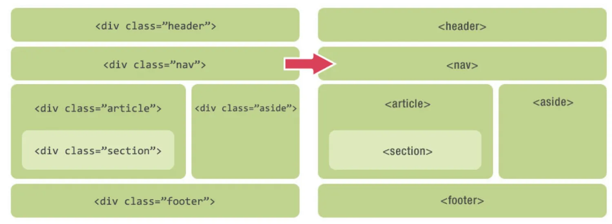

# 页面结构化




常用的语义化标签：

```html
<header>定义页眉</header>

<nav>定义导航</nav>

<hgroup>定义对网页标题的组合</hgroup>

<article>定义文章</article>

<section>定义文档中的区段</section>

<aside>定义文章的侧边栏</aside>

<footer>定义页脚</footer>
```

模版：

```html
<!DOCTYPE html>
<html lang="en">
<head>
   <meta charset="UTF-8">
   <title>demo</title>
</head>
<body>
<header role="banner">
   <nav role="navigation">
       <ul>
           <li>

           </li>
           <li>

           </li>
       </ul>
   </nav>
</header>

<main role="main">
   <article>
       <h1>

       </h1>
       <p>

       </p>
   </article>
   <!--如果是主体中各部分具有很强的相似性，可以使用section布局-->
   <section>

   </section>
   <section>

   </section>
   <section>

   </section>
</main>

<aside role="complementary">

</aside>

<footer role="contentinfo">

</footer>

</body>
</html>
```
