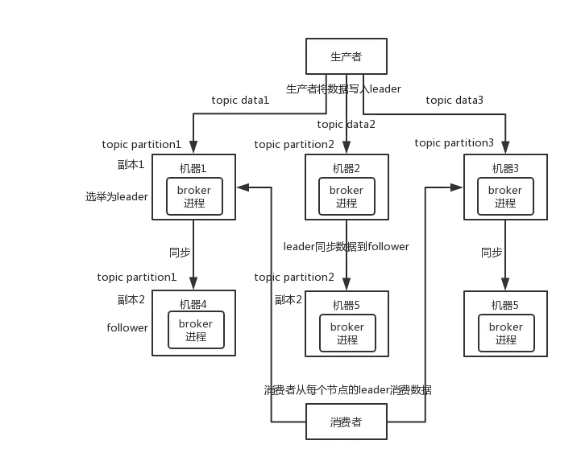

# Kafka的高可用性

Kafka 一个最基本的架构认识：

由多个 broker 组成，每个 broker 是一个节点；你创建一个 topic，这个 topic 可以划分为多个 partition，每个 partition 可以存在于不同的 broker 上，每个 partition 就放一部分数据

每个 partition 的数据都会同步到其它机器上，形成自己的多个 replica 副本。所有 replica 会选举一个 leader 出来，那么生产和消费都跟这个 leader 打交道，然后其他 replica 就是 follower。写的时候，leader 会负责把数据同步到所有 follower 上去，读的时候就直接读 leader 上的数据即可。

如果某个 broker 宕机了，没事儿，那个 broker上面的 partition 在其他机器上都有副本的，如果这上面有某个 partition 的 leader，那么此时会从 follower 中重新选举一个新的 leader 出来，大家继续读写那个新的 leader 即可。这就有所谓的高可用性了。

写数据的时候，生产者就写 leader ，然后 leader 将数据落地写本地磁盘，接着其他 follower 自己主动从 leader 来 pull 数据。一旦所有 follower 同步好数据了，就会发送 ack 给 leader ， leader 收到所有 follower 的 ack 之后，就会返回写成功的消息给生产者。（当然，这只是其中一种模式，还可以适当调整这个行为）

消费的时候，只会从 leader 去读，但是 只有当一个消息已经被所有 follower 都同步成功返回 ack 的时候，这个消息才会被消费者读到。

参考：[浅析消息中间件](https://woodwhales.cn/2019/06/24/033/)
