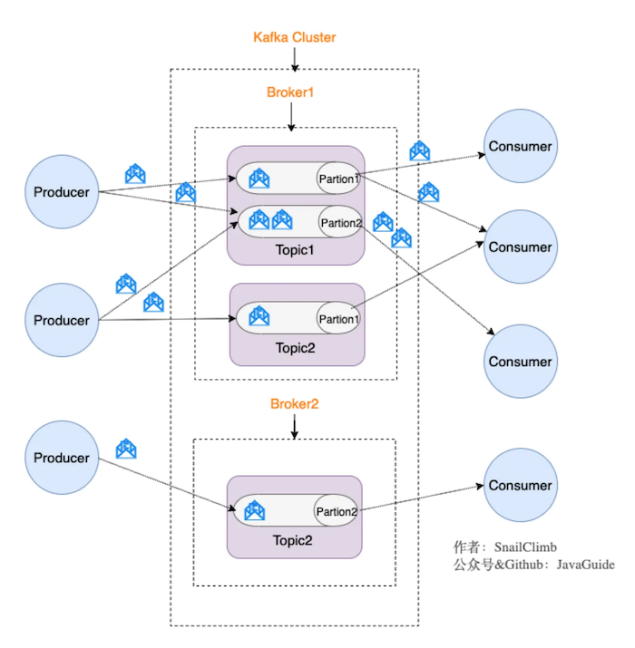

# 发布订阅模型

上面这张图也为我们引出了，Kafka 比较重要的几个概念：

1. **Producer（生产者）** : 产生消息的一方。
2. **Consumer（消费者）** : 消费消息的一方。
3. **Broker（代理）** : 可以看作是一个独立的 Kafka 实例。多个 Kafka Broker 组成一个 Kafka Cluster。

同时，你一定也注意到每个 Broker 中又包含了 Topic 以及 Partition 这两个重要的概念：

- **Topic（主题）** : Producer 将消息发送到特定的主题，Consumer 通过订阅特定的 Topic(主题) 来消费消息。
- **Partition（分区）** : Partition 属于 Topic 的一部分。一个 Topic 可以有多个 Partition ，并且同一 Topic 下的 Partition 可以分布在不同的 Broker 上，这也就表明一个 Topic 可以横跨多个 Broker 。这正如我上面所画的图一样。

参考：[Kafka常见问题总结](https://javaguide.cn/high-performance/message-queue/kafka-questions-01.html)
