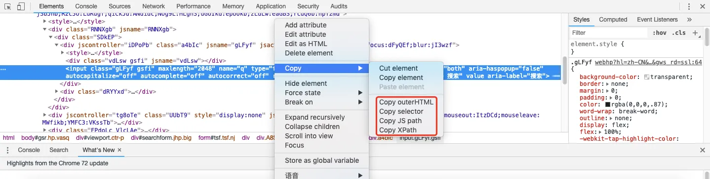

# HTML元素定位


selenium提供了八种单一元素定位方法：

- findElement(By.id())
- findElement(By.name())
- findElement(By.className())
- findElement(By.tagName())
- findElement(By.linkText())
- findElement(By.partialLinkText())
- findElement(By.xpath())
- findElement(By.cssSelector())

相对应的，对于一组元素的定位，也提供了八种方法：

- findElements(By.id())
- findElements(By.name())
- findElements(By.className())
- findElements(By.tagName())
- findElements(By.linkText())
- findElements(By.partialLinkText())
- findElements(By.xpath())
- findElements(By.cssSelector())

每个By方法的含义：

- By.id()：通过元素的id来完成username输入框的定位。
- By.name()：通过元素的name属性来完成对username输入框的定位。
- By.className()：通过元素的class属性来完成对username输入框的定位。
- By.tagName()：通过标签的name来完成header元素的定位。
- By.linkText()和By.partialLinkText()：通过链接元素的text属性来完成定位。partial可以只指定部分名称。
- By.xpath()：通过xpath定位。
- By.cssSelector()：通过css定位。

示例代码：

```java
package demo;
 
import org.openqa.selenium.By;
import org.openqa.selenium.WebDriver;
import org.openqa.selenium.WebElement;
import org.openqa.selenium.chrome.ChromeDriver;
import org.openqa.selenium.chrome.ChromeOptions;
 
public class FindElement {
    public static void main(String[] args) throws InterruptedException {
        System.setProperty("webdriver.chrome.driver", "/Users/givedrug/SeleniumWebDriver/chromedriver");
        ChromeOptions options = new ChromeOptions();
        options.addArguments(new String[]{"test-type"});
        WebDriver webDriver = new ChromeDriver(options);
 
        webDriver.get("http://www.baidu.com");
 
        //通过id找到输入栏
        WebElement input=webDriver.findElement(By.id("kw"));
        input.sendKeys("good job!");
 
        //通过id找到搜索按钮
        WebElement searchButton=webDriver.findElement(By.id("su"));
        searchButton.click();
 
        Thread.sleep(1000);
        webDriver.navigate().back();
 
        //通过name找到新闻链接
        WebElement newsLink=webDriver.findElement(By.name("tj_trnews"));
        newsLink.click();
 
        Thread.sleep(1000);
        webDriver.navigate().back();
 
        //通过classname找到图片搜索
        WebElement mapLink=webDriver.findElement(By.className("soutu-btn"));
        mapLink.click();
 
        Thread.sleep(1000);
 
        //通过tagname找到第一个input标签
        WebElement tag_input=webDriver.findElement(By.tagName("input"));
        System.out.println("location:"+tag_input.getLocation());
 
        //通过linktext找到视频链接
        WebElement videolink=webDriver.findElement(By.linkText("视频"));
        videolink.click();
 
        Thread.sleep(1000);
        webDriver.navigate().back();
 
        //通过partialLinkText找到视频链接
        WebElement videolink2=webDriver.findElement(By.partialLinkText("视"));
        videolink2.click();
 
        Thread.sleep(1000);
        webDriver.navigate().back();
 
        //通过xpath找到贴吧链接
        WebElement balink=webDriver.findElement(By.xpath("//*[@id=\"u1\"]/a[5]"));
        balink.click();
 
        Thread.sleep(1000);
        webDriver.navigate().back();
 
        //通过css找到学术链接
        WebElement learninglink=webDriver.findElement(By.cssSelector("#u1 > a:nth-child(6)"));
        learninglink.click();
 
        Thread.sleep(1000);
        webDriver.navigate().back();
        webDriver.quit();
    }
}
```

通过 Chrome 开发者工具查看 xpath 或 css 路径：

1. 在需要定位的元素上右键-检查
2. 在自动打开的开发者工具中，会展示出元素所对应的html源码位置，在选中的源码处右键-copy



（其中selector为css路径）
