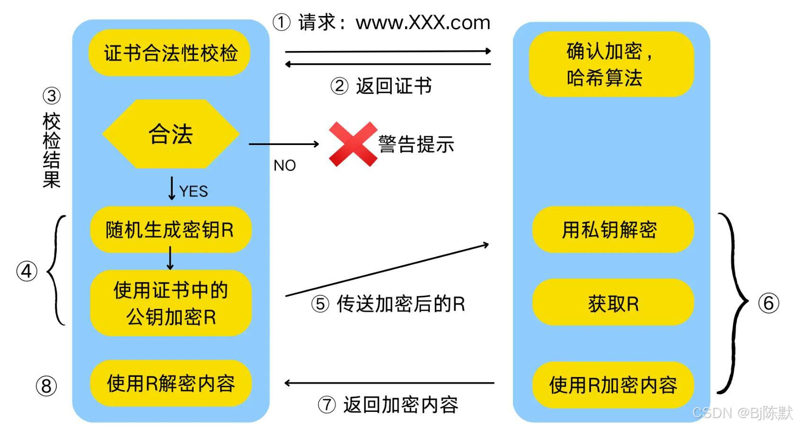

HTTP协议和SSL/TLS协议。HTTP协议就不用讲了，而SSL/TLS就是负责加密解密等安全处理的模块，所以HTTPS的核心在SSL/TLS上面。整个通信如下：

1、浏览器发起往服务器的443端口发起请求，请求携带了浏览器支持的加密算法和哈希算法。

2、服务器收到请求，选择浏览器支持的加密算法和哈希算法。

3、服务器将数字证书返回给浏览器，这里的数字证书可以是向某个可靠机构申请的，也可以是自制的。

4、浏览器进入数字证书认证环节，这一部分是浏览器内置的TLS完成的：

4.1 首先浏览器会从内置的证书列表中索引，找到服务器下发证书对应的机构，如果没有找到，此时就会提示用户该证书是不是由权威机构颁发，是不可信任的。如果查到了对应的机构，则取出该机构颁发的公钥。

4.2 用机构的证书公钥解密得到证书的内容和证书签名，内容包括网站的网址、网站的公钥、证书的有效期等。浏览器会先验证证书签名的合法性。签名通过后，浏览器验证证书记录的网址是否和当前网址是一致的，不一致会提示用户。如果网址一致会检查证书有效期，证书过期了也会提示用户。这些都通过认证时，浏览器就可以安全使用证书中的网站公钥了。

4.3 浏览器生成一个随机数R，并使用网站公钥对R进行加密。

5、浏览器将加密的R传送给服务器。

6、服务器用自己的私钥解密得到R。

7、服务器以R为密钥使用了对称加密算法加密网页内容并传输给浏览器。

8、浏览器以R为密钥使用之前约定好的解密算法获取网页内容。

**备注1**：前5步其实就是HTTPS的握手过程，这个过程主要是认证服务端证书（内置的公钥）的合法性。因为非对称加密计算量较大，整个通信过程**只会用到一次非对称加密算法**（主要是用来保护传输客户端生成的用于对称加密的随机数私钥）。**后续内容的加解密都是通过一开始约定好的对称加密算法进行的。**

**备注2**：SSL/TLS是HTTPS安全性的核心模块，TLS的前身是SSL，TLS1.0就是SSL3.1，TLS1.1是SSL3.2，TLS1.2则是SSL3.3。 SSL/TLS是建立在TCP协议之上，因而也是传输层级别的协议。其包括TLS Record Protocol和TLS Handshaking Protocols两个模块，后者负责握手过程中的身份认证，前者则保证数据传输过程中的完整性和私密性。

详细的通信流程为：

参考：
1. https://blog.csdn.net/chinansa/article/details/144778161
2. https://cloud.tencent.com/developer/news/86682
3. 《图解HTTP》上野宣
