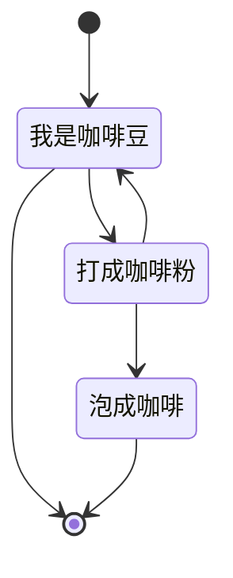

这是一个模版。

# 标题
# 一级标题
## 二级标题

### 三级标题

#### 四级标题

##### 五级标题

###### 六级标题

# 特殊字体

**粗体**

_斜体_

~~删除线~~

<u>下划线</u>

==高亮==

上标<sup>上标</sup>

下标<sub>下标</sub>

# 代码块

行内短代码：`短代码`

行间代码块：

```java
import java.math.BigInteger;

public class JavaBigInteger {

	public static void main(String[] args) {
		long startTime = System.currentTimeMillis();
		int n=100000;
		BigInteger fac=new BigInteger("1");
		while(n>0) {
			fac=fac.multiply(new BigInteger(Integer.toString(n)));
			n--;
		}
		//System.out.println(fac);
		System.out.println(fac.toString().length());
		long endTime = System.currentTimeMillis();
		System.out.println("time:" + (endTime - startTime) + "ms");
	}
}
```

# 链接、图片、附件

超链接：[google](www.google.com)


[markdown](assets/example/Markdown%20-%20Wikipedia.mhtml)

# 列表

无序列表：
- 无序列表
- 无序列表
- 无序列表

有序列表：
1. 有序列表
2. 有序列表
3. 有序列表

列表嵌套：
1. 有序列表
    - 无序列表
    - 无序列表
    - 无序列表
2. 有序列表
3. 有序列表

# 引用

> 这是一条引用
> 
> 这是一条引用
> 
> 这是一条引用
> 

# 分割线

---

# 参考

（参考：[abc](https://abc.com)）

（转载自：[abc](https://abc.com)）

**参考：**
1. [abc](https://abc.com)
2. 《123》

# 表格

| 1   | 2   | 3   |
| --- | --- | --- |
| 2   | 3   | 4   |
| 2   | 3   | 4   |
| 2   | 3   | 4   |

# 公式

居中公式：

$$  
E=mc^2  
$$

行内公式 这是一个行内公式：$E=mc^2$ 这是一个行内公式。

# 待办事项

- [ ] 待办1
- [x] 待办2

# 脚注

需要添加脚注<sup>1</sup>

[1] 这里是脚注

# 流程图


